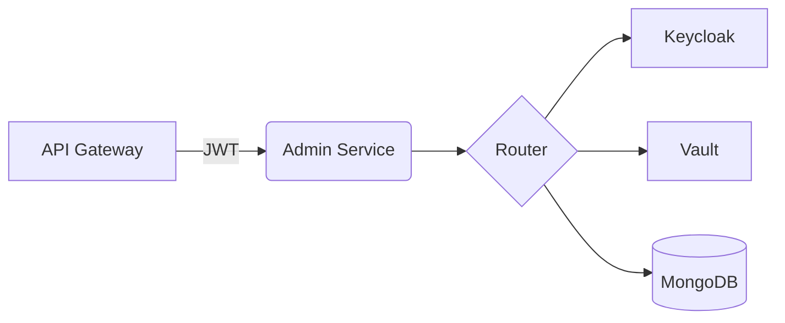
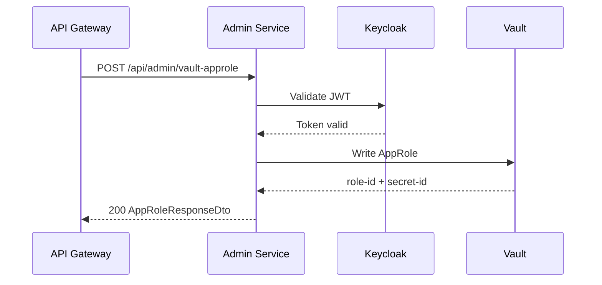
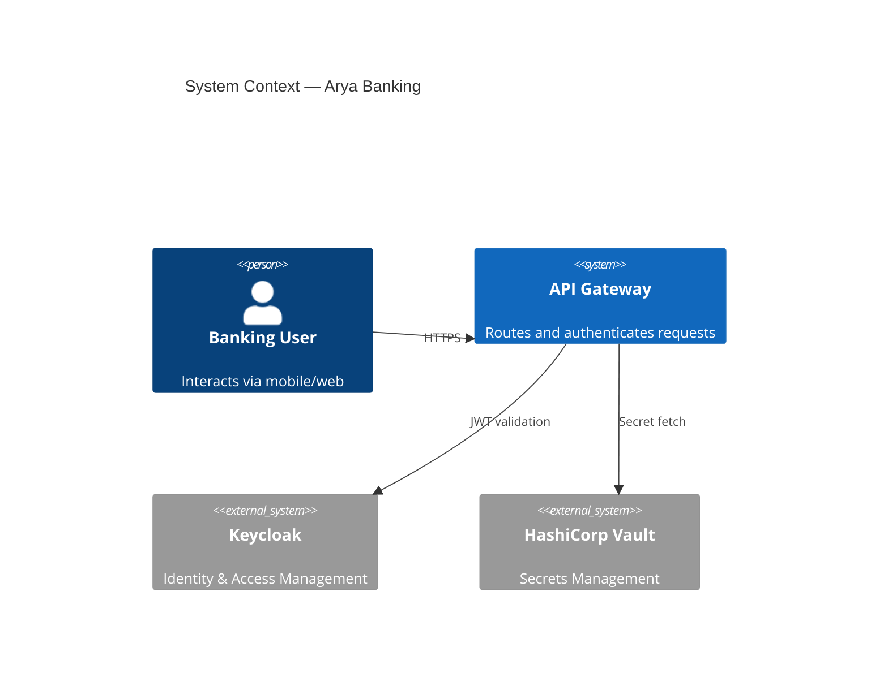
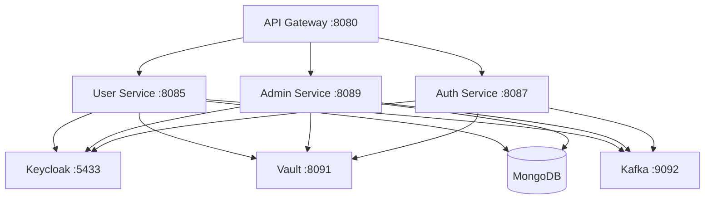
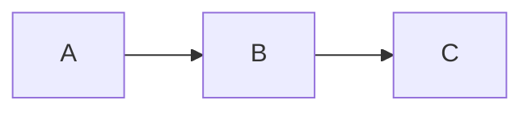

 
# Lotus Docs Skill
 
A comprehensive skill for generating Hugo Markdown files that are fully
compatible with the **Lotus Docs** theme (https://lotusdocs.dev). Every file
produced by this skill must be drop-in ready — place it under `content/docs/`
and `hugo server` should render it without modification.
 
---
 
## 1. What is Lotus Docs?
 
Lotus Docs is a Hugo static-site theme built for **technical documentation**.
It ships with Bootstrap 5, PrismJS syntax highlighting, FlexSearch / DocSearch,
Mermaid diagrams, KaTeX math, a feedback widget, analytics integrations, and a
rich shortcode library. It targets small-to-medium documentation sets (≤ 100
pages).
 
**Requirements for the Hugo project:**
- Hugo ≥ v0.140.0 (Extended Version)
- Go ≥ v1.21
- git
 
---
 
## 2. File & Folder Conventions
 
```
content/
└── docs/
    ├── _index.md                 ← section root (required)
    ├── getting-started.md        ← top-level page (weight controls order)
    └── services/                 ← second-level section
        ├── _index.md             ← section index (required for dropdown)
        ├── admin-service.md
        └── user-service.md
```
 
**Rules:**
- All documentation lives under `content/docs/`.
- Second-level sections need a parent directory with an `_index.md` file.
- `weight` is the **only** mechanism for ordering sidebar items. Use multiples
  of 100 (100, 200, 300 …) to leave room for insertions.
- Lower `weight` = higher position in the menu.
 
---
 
## 3. Front Matter — Complete Reference
 
Every `.md` file MUST begin with a front matter block. Lotus Docs supports
**TOML** (`+++`), **YAML** (`---`), or **JSON** (`{}`). Always use YAML (`---`)
for consistency.
 
### 3.1 Required Fields
 
```yaml
---
title: "Page Title"           # String. Displayed as H1 and in sidebar.
weight: 100                   # Integer. Controls sidebar order (lower = higher).
---
```
 
### 3.2 Full Front Matter Example (all supported fields)
 
```yaml
---
title: "Admin Service"
description: "Comprehensive docs for the admin-service microservice."
icon: "manage_accounts"       # Material Symbols icon name (outlined style)
date: "2025-03-01T00:00:00Z"
lastmod: "2025-03-20T00:00:00Z"
draft: false
toc: true                     # Enable Table of Contents for this page
weight: 300
author: "Karthik Kulkarni"
tags: ["microservices", "keycloak", "vault"]
---
```
 
### 3.3 Front Matter Field Reference
 
| Field | Type | Default | Description |
|-------|------|---------|-------------|
| `title` | string | — | Page title. Used as H1 and sidebar label. **Required.** |
| `description` | string | `""` | Shown under the H1 when `params.docs.descriptions = true`. |
| `icon` | string | `"article"` | Material Symbols icon name shown next to the title and in the sidebar (when `sidebarIcons = true`). |
| `weight` | integer | `999` | Sidebar ordering. Lower = higher. **Required.** |
| `toc` | boolean | `true` | Show a Table of Contents for this page. |
| `draft` | boolean | `false` | Exclude from production builds when `true`. |
| `date` | string | — | ISO 8601 creation date. |
| `lastmod` | string | — | ISO 8601 last-modified date. Shown when `lastMod = true` in config. |
| `author` | string | — | Page author name. |
| `tags` | array | `[]` | Tag list for taxonomy pages. |
 
---
 
## 4. Shortcodes — Full Reference
 
Shortcodes are the most powerful Lotus Docs feature. Always prefer shortcodes
over raw HTML. All shortcodes use Hugo's `` (non-rendering) or
`{}` (Markdown-rendering) delimiters.
 
---
 
### 4.1 Alerts
 
Use alerts to draw attention to important information.
 
**Syntax (self-closing):**
```

```
 
**Syntax (paired — supports Markdown and HTML inside):**
```
{}
**Warning:** This is _important_.
{}
```
 
**Parameters:**
 
| Parameter | Required | Values | Description |
|-----------|----------|--------|-------------|
| `text` | Yes (self-closing) | string | Alert message text. Supports HTML. |
| `context` | No | `info` `success` `danger` `warning` `primary` `light` `dark` | Sets the alert colour and default icon. Defaults to theme primary colour. |
| `icon` | No | emoji or `" "` | Override the default context icon. Use `icon=" "` (space) to hide the icon entirely. `icon=""` (empty) keeps the default. |
 
**All context variants:**
 
```

 







```
 
**Paired alert with Markdown content:**
```
{}
#### Pro Tip
Use **paired shortcodes** when you need:
1. Markdown lists
2. Code snippets
3. HTML tags like <strong> or <em>
{}
```
 
> **Important:** Paired `%`-delimited alerts require
> `unsafe = true` under `[markup.goldmark.renderer]` in `hugo.toml`.
 
---
 
### 4.2 Tables
 
The `` shortcode applies Bootstrap 5 table styles. Regular
Markdown tables (`|---|`) also work but have minimal styling.
 
**Basic shortcode table:**
```

| Column A | Column B | Column C |
|----------|----------|----------|
| Value 1  | Value 2  | Value 3  |

```
 
**Table style options** (passed as a string argument):
 
| Option | Effect |
|--------|--------|
| _(none)_ | Bordered table, borderless floating header |
| `"table-striped"` | Alternating row background (zebra stripes) |
| `"table-striped-columns"` | Alternating column background |
| `"table-hover"` | Highlight row on hover |
| `"table-borderless"` | Remove all borders |
| `"table-sm"` | Compact — reduced cell padding |
| `"table-xs"` | Extra compact |
| `"table-responsive"` | Horizontal scroll on small screens |
 
**Combining options:**
```

| Name    | Role    | Service    |
|---------|---------|------------|
| Karthik | Dev     | admin-svc  |

```
 
---
 
### 4.3 Tabs
 
Use tabs to present platform-specific or variant content side by side.
Requires a paired `tabs` (parent) + one or more `tab` (child) shortcodes.
 
**Syntax:**
```

 
{}
Content for Spring Boot tab.
{}
 
{}
Content for Quarkus tab.
{}
 
{}
Content for Micronaut tab.
{}
 

```
 
**`tabs` parameters:**
 
| Parameter | Required | Description |
|-----------|----------|-------------|
| `tabTotal` | Yes | Total number of nested `tab` shortcodes. Must match exactly. |
| `tabRightAlign` | No | Integer. Right-aligns this tab number and all tabs after it. |
 
**`tab` parameters:**
 
| Parameter | Required | Description |
|-----------|----------|-------------|
| `tabName` | Yes | The tab label text. |
 
**Right-aligned tabs example:**
```

{}First tab content.{}
{}Right-aligned tab.{}
{}Also right-aligned.{}

```
 
> **Best practice:** Always set `tabTotal` to the exact number of `tab`
> children. A mismatch will cause broken rendering.
 
---
 
### 4.4 Prism Code Highlighting (Shortcode)
 
For advanced code block options beyond standard fenced code, use the `prism`
shortcode. It gives you line numbers, line highlighting, and line anchors.
 
**Syntax:**
```

public class HelloWorld {
    public static void main(String[] args) {
        System.out.println("Hello, Arya Banking!");
    }
}

```
 
**Code Fence equivalent with Prism options:**
 
~~~
```java {linenos=table, hl_lines=["2-3"], linenostart=1, anchorlinenos=true}
public class Example {
    private final String name;  // highlighted
    private final int value;    // highlighted
}
```
~~~
 
**Prism Code Fence translation options:**
 
| Option | Values | Description |
|--------|--------|-------------|
| `linenos` | `true` `false` `table` `inline` | Enable line numbers |
| `hl_lines` | `[3,"5-7"]` | Highlight specific lines or ranges |
| `linenostart` | integer | Start line number count from this value |
| `anchorlinenos` | `true` `false` | Make line numbers linkable anchors |
 
**Prism Themes** (set in `hugo.toml` under `[params.docs]`):
 
| Theme | Description |
|-------|-------------|
| `lotusdocs` | Default — clean, light |
| `solarized-light` | Warm solarized palette |
| `twilight` | Dark blue theme |
| `lucario` | Dark teal theme |
 
---
 
### 4.5 Markdownify
 
Renders Markdown inside shortcode parameters that normally accept only plain
text. Useful when embedding Markdown in custom layouts.
 
```

This is **bold** and this is `code`.

```
 
---
 
### 4.6 KaTeX (Math Rendering)
 
Render LaTeX math inline or as display blocks. Enabled via the `katex`
shortcode or via the `katex` fenced code block.
 
**Inline math:**
```
x = \frac{-b \pm \sqrt{b^2 - 4ac}}{2a}
```
 
**Display block (centered):**
```

\int_{-\infty}^{\infty} e^{-x^2} dx = \sqrt{\pi}

```
 
---
 
## 5. Mermaid Diagrams
 
Mermaid diagrams are automatically enabled whenever Mermaid syntax is detected
in a page. Use the `mermaid` language identifier in a fenced code block.
 
```

```
 
**Supported Mermaid diagram types:**
 
| Type | Identifier | Use Case |
|------|-----------|----------|
| Flowchart | `flowchart LR` / `flowchart TD` | Architecture, decision flows |
| Sequence | `sequenceDiagram` | Service-to-service interactions |
| Class | `classDiagram` | Domain model relationships |
| State | `stateDiagram-v2` | State machines, registration flows |
| Gantt | `gantt` | Sprint/release timelines |
| Git Graph | `gitGraph` | Branch strategies |
| Pie Chart | `pie` | Distribution breakdowns |
| User Journey | `journey` | User flow documentation |
| C4 | `C4Context` | System context architecture |
 
**Sequence diagram example:**
```

```
 
**C4 context diagram example:**
```

```
 
---
 
## 6. Syntax Highlighting — Code Fences
 
Standard fenced code blocks are highlighted automatically by **PrismJS**
(default) or **Chroma** (`prism = false` in config). Always declare the
language right after the opening fence.
 
```
```java
@RestController
@RequestMapping("/api/admin")
public class ExampleController {
 
    @GetMapping("/health")
    public ResponseEntity<String> health() {
        return ResponseEntity.ok("UP");
    }
}
```
```
 
**Supported language identifiers** (common ones):
 
| Language | Identifier |
|----------|-----------|
| Java | `java` |
| YAML | `yaml` |
| JSON | `json` |
| Bash / Shell | `bash` or `shell` |
| HCL (Vault) | `hcl` |
| XML (Maven) | `xml` |
| Dockerfile | `dockerfile` |
| Go | `go` |
| Python | `python` |
| SQL | `sql` |
| Markdown | `markdown` |
| TOML | `toml` |
| Properties | `properties` |
 
> Prism supports ~290 languages; Chroma supports ~200.
 
---
 
## 7. Content Structure Patterns
 
### 7.1 Standard API Documentation Page
 
```markdown
---
title: "User Service API"
description: "REST API reference for the user-service."
icon: "api"
weight: 200
toc: true
---
 
## Overview
 
Brief service description.
 

 
---
 
## Endpoints
 
### `GET /api/users/{id}`
 

| Parameter | Type | Location | Required | Description |
|-----------|------|----------|----------|-------------|
| `id` | String | Path | Yes | User's business ID |

 
**Response `200 OK`:**
 
```json
{
  "userId": "USR-001",
  "status": "ACTIVE"
}
```
 

```
 
### 7.2 Multi-Environment Configuration Page
 
```markdown
---
title: "Configuration Reference"
weight: 500
toc: true
---
 
## Database Settings
 

 
{}
```yaml
spring:
  data:
    mongodb:
      uri: mongodb://localhost:27017/arya-banking
```
{}
 
{}
```yaml
spring:
  data:
    mongodb:
      uri: ${MONGO_URI}
```
{}
 
{}
```yaml
environment:
  MONGO_URI: mongodb://mongo:27017/arya-banking
```
{}
 

```
 
### 7.3 Architecture Overview Page
 
```markdown
---
title: "Architecture Overview"
icon: "hub"
weight: 100
toc: true
---
 
## System Architecture
 

 

```
 
---
 
## 8. Front Matter Icon Reference
 
Lotus Docs uses **Material Symbols (Outlined)** icons. Set the icon name as
the `icon` field value. Common icons for technical docs:
 
| Icon Name | Use For |
|-----------|---------|
| `article` | Default page icon |
| `api` | API reference pages |
| `hub` | Architecture pages |
| `manage_accounts` | Admin / user management |
| `security` | Security configuration |
| `settings` | Configuration reference |
| `rocket_launch` | Quickstart / getting started |
| `storage` | Database / persistence |
| `send` | Kafka / messaging |
| `lock` | Authentication / secrets |
| `schema` | Data models / diagrams |
| `code` | Code / shortcodes |
| `deployed_code` | Deployment pages |
| `build` | Build / CI/CD |
| `help` | Troubleshooting / FAQ |
| `info` | Overview |
| `tune` | Theme options |
| `highlight` | Syntax highlighting |
 
Find all icons at: https://fonts.google.com/icons?icon.style=Outlined
 
---
 
## 9. Hugo Site Configuration Reference (`hugo.toml`)
 
For reference when creating or reviewing the site config alongside docs:
 
```toml
baseURL = 'https://docs.arya-banking.dev/'
languageCode = 'en-us'
title = 'Arya Banking Docs'
 
[module]
  [[module.imports]]
    path = "github.com/colinwilson/lotusdocs"
    disable = false
  [[module.imports]]
    path = "github.com/gohugoio/hugo-mod-bootstrap-scss/v5"
    disable = false
 
[markup.goldmark.renderer]
  unsafe = true               # Required for %{} paired alert shortcodes
 
[params]
  google_fonts = [["Inter", "300, 400, 600, 700"], ["Fira Code", "500, 700"]]
  sans_serif_font = "Inter"
  mono_font = "Fira Code"
 
[params.footer]
  copyright = "© 2025 [Arya Banking](https://github.com/Event-Based-Banking-Application)"
 
[params.social]
  github = "Event-Based-Banking-Application"
 
[params.docs]
  title = "Arya Banking"
  pathName = "docs"
  themeColor = "blue"         # blue | green | red | yellow | emerald | cardinal | magenta | cyan
  darkMode = false
  prism = true
  prismTheme = "lotusdocs"    # lotusdocs | solarized-light | twilight | lucario
 
  # UI
  breadcrumbs = true
  descriptions = true
  backToTop = true
  navDesc = true
  navDescTrunc = 40
  listDescTrunc = 100
 
  # Icons
  sidebarIcons = true
  titleIcon = true
 
  # Git integration
  repoURL = "https://github.com/Event-Based-Banking-Application/arya-banking-docs"
  repoBranch = "main"
  editPage = true
  lastMod = true
  lastModRelative = true
 
  # ToC
  toc = true
  tocMobile = true
  scrollSpy = true
 
  # Links
  intLinkTooltip = true
  extLinkNewTab = true
 
[params.flexsearch]
  enabled = true
  tokenize = "forward"
  minQueryChar = 2
  maxResult = 8
```
 
### Theme Color Options
 
| Value | Accent Color |
|-------|-------------|
| `blue` | Default blue |
| `green` | Emerald green |
| `red` | Red |
| `yellow` | Amber yellow |
| `emerald` | Emerald |
| `cardinal` | Cardinal red |
| `magenta` | Magenta |
| `cyan` | Cyan |
 
---
 
## 10. Content Ordering Rules
 
- Use `weight` in every page's front matter. **Never omit it.**
- Increment by **100** between pages: `100, 200, 300 …`
- For `_index.md` files in section directories, the `weight` controls the
  section's position in the sidebar (not the individual pages inside it).
- Pages with equal weight are ordered alphabetically by filename.
 
```yaml
# Example weights for a services section
# _index.md  weight: 200   → appears as 2nd top-level item
# admin-service.md  weight: 100  → first in the section
# auth-service.md   weight: 200
# user-service.md   weight: 300
```
 
---
 
## 11. Writing Rules for AI-Generated Docs
 
When generating a Lotus Docs page, follow these rules strictly:
 
1. **Always include front matter** — `title`, `weight`, and `toc` at minimum.
2. **Use `` shortcodes** instead of `> blockquotes` for warnings,
   notes, and callouts.
3. **Use `` shortcodes** for data tables (especially API
   references). Add `"table-striped table-sm"` for dense reference tables.
4. **Use ``** for any content that varies by environment, OS,
   language, or config format (e.g., YAML vs TOML vs JSON).
5. **Use fenced ` ```mermaid ` blocks** for all architecture and flow diagrams.
6. **Always declare a language** on every fenced code block.
7. **Use `icon` front matter** to match the page's domain — architecture pages
   get `"hub"`, API pages get `"api"`, config pages get `"settings"`, etc.
8. **Section `_index.md` files** need only `title`, `weight`, and optionally
   `icon` and `description`. They do not need body content.
9. **Do not use raw HTML** — use shortcodes instead.
10. **Do not use `> blockquotes`** for callouts — use ``.
11. **Paired alert shortcodes** (`{}`) require `unsafe = true` in
    the Hugo config. Call this out in a comment if using them.
12. **tabTotal must equal** the exact count of nested `{}` children.
 
---
 
## 12. Section `_index.md` Template
 
```yaml
---
title: "Services"
description: "Documentation for all Arya Banking microservices."
icon: "deployed_code"
weight: 200
---
```
 
No body content is needed. Lotus Docs auto-generates a card grid from the
child pages.
 
---
 
## 13. Quick Cheat Sheet
 
```
# Front matter minimum
---
title: "My Page"
weight: 100
toc: true
---
 
# Alerts




 
# Table (striped + small)

| Col 1 | Col 2 |
|-------|-------|
| a     | b     |

 
# Tabs (3 tabs)

{}Content A{}
{}Content B{}
{}Content C{}

 
# Mermaid diagram

 
# Code block (always declare language)
```java
System.out.println("Hello");
```
```
 