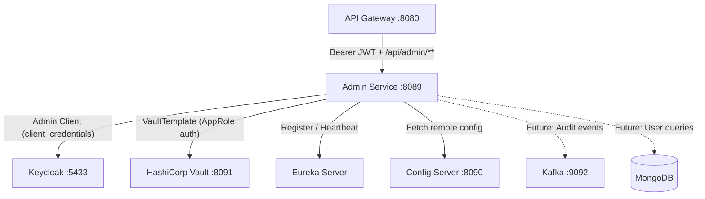
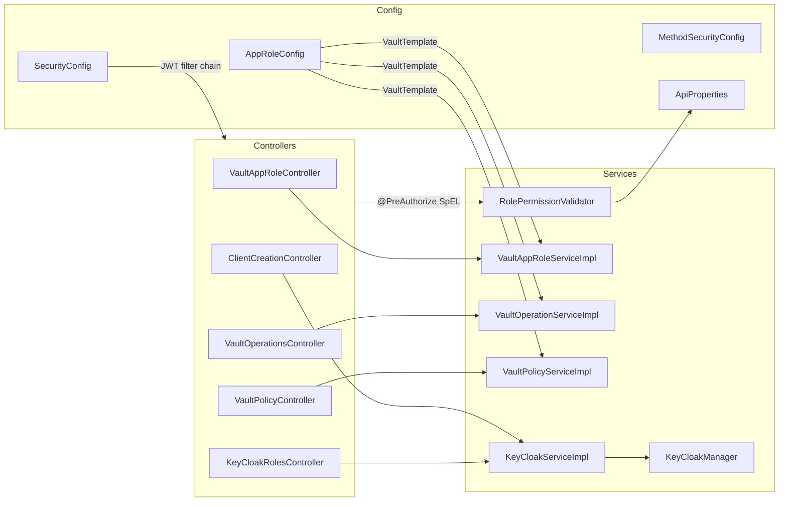

## System Context

The admin-service sits between the API Gateway and the platform's two infrastructure systems — HashiCorp Vault and Keycloak. All admin requests arrive through the gateway after JWT validation.





---

## Internal Component Map



---

## Project Structure

```text {linenos=table, anchorlinenos=true}
arya-banking-admin-service/
├── .github/
│   ├── issues.json
│   └── workflows/
│       ├── auto-create-issues.yaml
│       ├── deploy.yml
│       ├── sonar-report.yaml
│       └── sonar-report.yml
├── src/
│   └── main/
│       ├── java/org/arya/banking/admin/
│       │   ├── AryaBankingAdminServiceApplication.java
│       │   ├── annotation/
│       │   │   ├── AdminRestController.java
│       │   │   └── AllowedRoles.java
│       │   ├── config/
│       │   │   ├── ApiProperties.java
│       │   │   ├── AppRoleConfig.java
│       │   │   ├── MethodSecurityConfig.java
│       │   │   ├── SecurityConfig.java
│       │   │   └── VaultConfigs.java
│       │   ├── controller/
│       │   │   ├── ClientCreationController.java
│       │   │   ├── KeyCloakRolesController.java
│       │   │   ├── VaultAppRoleController.java
│       │   │   ├── VaultOperationsController.java
│       │   │   └── VaultPolicyController.java
│       │   ├── dto/
│       │   │   ├── AppRole.java
│       │   │   ├── AppRoleResponseDto.java
│       │   │   ├── CreateAppRoleDto.java
│       │   │   ├── KeyCloakClientResponse.java
│       │   │   ├── KeycloakRole.java
│       │   │   ├── VaultApiResponseDto.java
│       │   │   ├── VaultResponseDto.java
│       │   │   └── VaultSecretDto.java
│       │   ├── mapper/
│       │   │   ├── KeycloakRoleMapper.java
│       │   │   └── VaultResponseMapper.java
│       │   └── service/
│       │       ├── KeyCloakManager.java
│       │       ├── KeyCloakService.java
│       │       ├── VaultAppRoleService.java
│       │       ├── VaultOperationService.java
│       │       ├── VaultPolicyService.java
│       │       └── impl/
│       │           ├── KeyCloakServiceImpl.java
│       │           ├── RolePermissionValidator.java
│       │           ├── VaultAppRoleServiceImpl.java
│       │           ├── VaultOperationServiceImpl.java
│       │           └── VaultPolicyServiceImpl.java
│       └── resources/
│           ├── application.yaml
│           ├── bootstrap.yml
│           ├── admin-service-policy.hcl
│           └── user-service-policy.hcl
└── pom.xml
```

---

## Key Design Decisions

### Operation-Based RBAC

Rather than hardcoding role names in `@PreAuthorize` annotations, the service externalises the role-to-operation mapping into `application.yaml` under `security.api-roles`. This means adding or changing roles for an operation is a **config-only change** — no code redeployment required.

```yaml {linenos=table, anchorlinenos=true}
security:
  api-roles:
    create-client:
      - ROLE_ADMIN
    query-realm:
      - ROLE_ADMIN
    vault-ops:
      - ROLE_ADMIN
```

The `RolePermissionValidator` bean reads this map and is referenced in SpEL across all controllers:

```java {linenos=table, anchorlinenos=true}
@PreAuthorize("@rolePermissionValidator.hasAnyRole(authentication, 'vault-ops')")
```

### Policy-as-Code

Vault HCL policy files (`admin-service-policy.hcl`, `user-service-policy.hcl`) are stored in `src/main/resources/` and checked in to the repository. The `VaultPolicyServiceImpl` reads them from the classpath and uploads them to Vault on demand via API. This keeps policy definitions version-controlled alongside the service that owns them.

### Common Library Integration

The `@ComponentScan` in the main class includes `org.arya.banking.common`, meaning the common library's `@Component` beans — `GlobalExceptionHandler`, `MetadataInitializer`, base mappers — are registered automatically without any explicit import configuration.

### Composite `@AdminRestController` Annotation

To avoid repeating `@RestController` + `@RequestMapping("/api/admin")` on every controller, a composed annotation `@AdminRestController` bundles both. All controllers except `ClientCreationController` use it.


