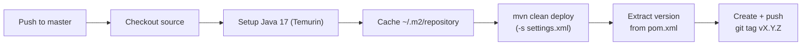

## GitHub Actions Workflows

One workflow is defined under `.github/workflows/`.

---

### deploy.yml — Build & Release

**Trigger:** Push to `master` branch, or manual `workflow_dispatch`.



**Key details:**
- Publishes the JAR to **GitHub Packages** using the `GH_PAT` secret.
- Automatically tags the commit with the version from `pom.xml` (e.g., `v1.0.0`).
- The `settings.xml` at the repo root wires GitHub Packages authentication using `GITHUB_ACTOR` and `GH_PAT`.

---

## Maven Build Configuration

### Key Build Plugins


| Plugin | Version | Purpose |
|---|---|---|
| `maven-compiler-plugin` | `3.11.0` | Wires MapStruct + Lombok annotation processors in the correct order |
| `spotbugs-maven-plugin` | `4.8.6.1` | Static bytecode analysis — flags potential bugs |
| `jacoco-maven-plugin` | `0.8.13` | Code coverage instrumentation and XML report generation |
| `spring-boot-maven-plugin` | — | Produces executable JAR + Buildpack container image |


### Annotation Processor Order

MapStruct must run **after** Lombok so that Lombok-generated getters/setters are visible to MapStruct during compilation:

```xml {linenos=table, anchorlinenos=true}
<compilerArgs>
  <arg>-Amapstruct.suppressGeneratorTimestamp=true</arg>
  <arg>-Amapstruct.defaultComponentModel=spring</arg>
</compilerArgs>
<annotationProcessorPaths>
  <path>org.projectlombok:lombok:1.18.36</path>
  <path>org.mapstruct:mapstruct-processor:1.5.5.Final</path>
</annotationProcessorPaths>
```

### Container Image

The `spring-boot-maven-plugin` builds a container image using **Cloud Native Buildpacks** with an **Ubuntu Noble** base:

```bash {linenos=table, anchorlinenos=true}
mvn spring-boot:build-image
```

The resulting image is tagged as `arya-banking-admin-service:{version}`.

---

## Local Docker Compose

A `docker-compose.yaml` at the repo root provides a minimal local Kafka stack for testing future event publishing features:

```yaml {linenos=table, anchorlinenos=true}
services:
  kafka:
    image: confluentinc/cp-kafka
    ports:
      - 9092:9092
      - 29092:29092
      - 29093:29093
    environment:
      KAFKA_PROCESS_ROLES: broker,controller
      KAFKA_NODE_ID: 1
      CLUSTER_ID: 5hci6rGNQECCvCLOiFDKow

  schema-registry:
    image: confluentinc/cp-schema-registry
    ports:
      - 8081:8081
    depends_on:
      - kafka
```


