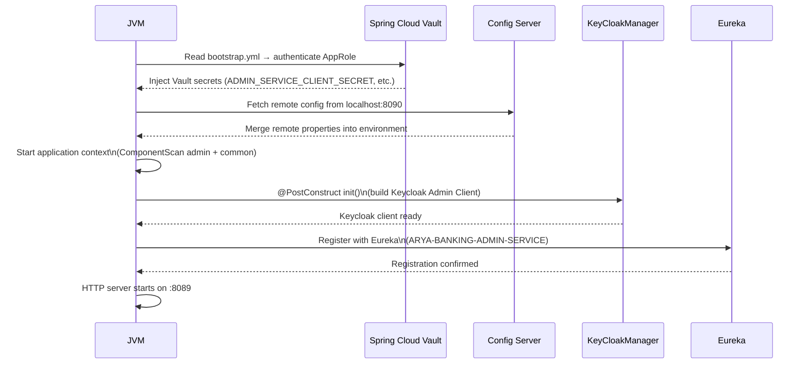

## Application Entry Point

**File:** `org.arya.banking.admin.AryaBankingAdminServiceApplication`


@SpringBootApplication(exclude = {
    DataSourceAutoConfiguration.class,
    DataSourceTransactionManagerAutoConfiguration.class,
    HibernateJpaAutoConfiguration.class
})
@ComponentScan(basePackages = {
    "org.arya.banking.admin",
    "org.arya.banking.common"
})
@EnableMongoAuditing
@EnableDiscoveryClient
public class AryaBankingAdminServiceApplication {

    public static void main(String[] args) {
        SpringApplication.run(AryaBankingAdminServiceApplication.class, args);
    }
}


---

## Annotation Breakdown

### `@SpringBootApplication(exclude = ...)`

The admin-service is **MongoDB-only** — it has no relational database. The three excluded auto-configurations prevent Spring Boot from attempting to set up a DataSource (JDBC), a transaction manager backed by a DataSource, and Hibernate JPA. Without these exclusions, the application would fail on startup because no `javax.sql.DataSource` bean is present on the classpath.


| Excluded Class | Why |
|---|---|
| `DataSourceAutoConfiguration` | Prevents JDBC DataSource bean creation |
| `DataSourceTransactionManagerAutoConfiguration` | Prevents JDBC transaction manager setup |
| `HibernateJpaAutoConfiguration` | Prevents JPA/Hibernate EntityManagerFactory setup |




---

### `@ComponentScan(basePackages = {...})`

By default, Spring Boot scans only the package of the main class and its sub-packages (`org.arya.banking.admin`). The explicit `@ComponentScan` extends the scan to include `org.arya.banking.common`, which means:

- `GlobalExceptionHandler` (`@RestControllerAdvice`) is registered — all `GlobalException` subclasses are handled automatically.
- `MetadataInitializer` (active under `metadata-loader` profile) is picked up without any additional import.
- Common `@Component`, `@Service`, and `@Mapper` beans from the shared library are wired into the application context.



---

### `@EnableMongoAuditing`

Activates Spring Data MongoDB's auditing infrastructure. Any document class annotated with `@CreatedDate` and `@LastModifiedDate` (inherited from `AryaBase` in the common library) will have those fields populated automatically on insert and update.

```java {linenos=table, anchorlinenos=true}
// From AryaBase in arya-banking-common
public abstract class AryaBase {
    @CreatedDate
    private Instant createdAt;

    @LastModifiedDate
    private Instant updatedAt;

    private boolean deleted;
}
```

---

### `@EnableDiscoveryClient`

Registers the service with **Netflix Eureka** on startup. The service appears in the Eureka dashboard as `ARYA-BANKING-ADMIN-SERVICE` and can be resolved by other services using its logical name through the gateway or Feign clients.

---

## Custom Annotations

### `@AdminRestController`

**File:** `org.arya.banking.admin.annotation.AdminRestController`

A composed annotation that bundles `@RestController` and `@RequestMapping("/api/admin")` into a single declaration. All controllers except `ClientCreationController` use it.

```java {linenos=table, anchorlinenos=true}
@Target({ElementType.TYPE, ElementType.METHOD})
@Retention(RetentionPolicy.RUNTIME)
@RestController
@RequestMapping("/api/admin")
public @interface AdminRestController {}
```

**Usage on a controller:**

```java {linenos=table, anchorlinenos=true}
@AdminRestController   // replaces @RestController + @RequestMapping("/api/admin")
public class VaultAppRoleController {

    @GetMapping("/vault-approle")
    public ResponseEntity<List<String>> getAppRoles() { ... }
}
```

**Why it matters:** Without this annotation, every controller would need to repeat `@RequestMapping("/api/admin")` individually. A single change to the base path requires touching only the annotation definition, not every controller.



---

### `@AllowedRoles`

**File:** `org.arya.banking.admin.annotation.AllowedRoles`

A method-level meta-annotation that wraps the `RolePermissionValidator` SpEL expression behind a clean, declarative interface.

```java {linenos=table, anchorlinenos=true}
@Target({ElementType.METHOD})
@Retention(RetentionPolicy.RUNTIME)
@PreAuthorize("@rolePermissionValidator.hasAnyRole(authentication, #allowedRoles.value())")
public @interface AllowedRoles {
    String value();
}
```

**Intended usage:**

```java {linenos=table, anchorlinenos=true}
// Instead of this (current approach):
@PreAuthorize("@rolePermissionValidator.hasAnyRole(authentication, 'vault-ops')")
@GetMapping("/vault-approle")
public ResponseEntity<?> getAppRoles() { ... }

// You would write:
@AllowedRoles("vault-ops")
@GetMapping("/vault-approle")
public ResponseEntity<?> getAppRoles() { ... }
```

**How it works:**

The `#allowedRoles.value()` in the SpEL expression is a parameter reference — `#allowedRoles` refers to the annotation instance itself, and `.value()` returns the `String` passed to the annotation. Spring Security evaluates this expression at method interception time, passing the resolved string to `RolePermissionValidator.hasAnyRole(authentication, operation)`.



---

## Startup Sequence




