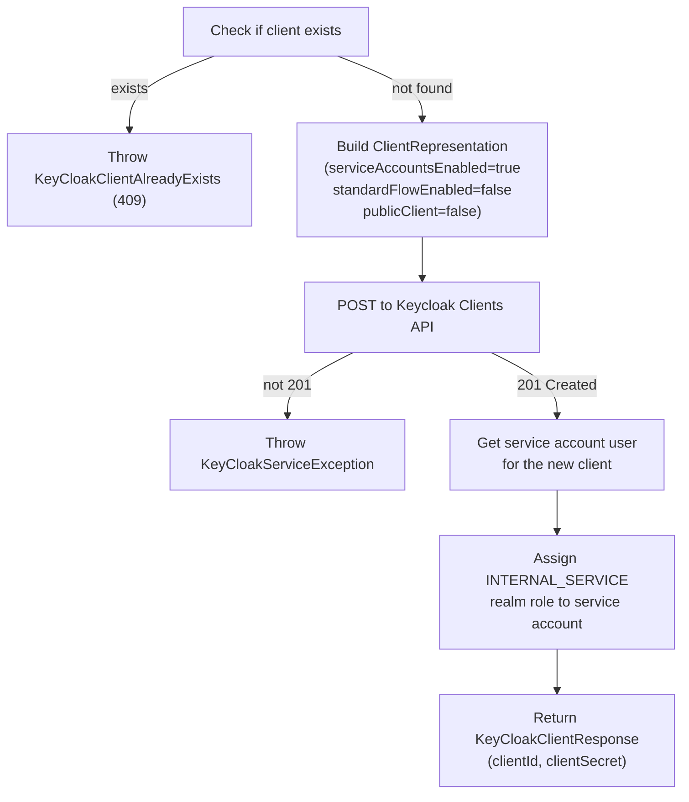

## Overview

The admin-service uses the **Keycloak Admin Client** (`keycloak-admin-client:26.0.4`) to programmatically manage the `event-based-banking-service` realm. It is the only service in the platform that holds admin-level Keycloak credentials.

The integration covers:
- Creating confidential OAuth2 clients for new microservices (service accounts flow)
- Listing and creating realm-level roles
- Assigning roles to the service account of a newly provisioned client

---

## KeyCloakManager

`KeyCloakManager` is a `@Component` that acts as a factory and accessor for the Keycloak Admin API. It initialises the client on startup via `@PostConstruct` using the `client_credentials` grant type.

```java {linenos=table, anchorlinenos=true}
@PostConstruct
public void init() {
    keycloak = KeycloakBuilder.builder()
        .serverUrl(serverUrl)
        .realm(keyCloakRealm)
        .clientId(clientId)
        .clientSecret(clientSecret)
        .grantType(CLIENT_CREDENTIALS)
        .build();
}
```

The `clientSecret` is resolved from Vault at startup (`${ADMIN_SERVICE_CLIENT_SECRET}`), so `KeyCloakManager` only initialises correctly after Vault bootstrap completes.

### Accessor Methods


| Method | Returns | Use |
|---|---|---|
| `getKeyCloakInstanceWithRealm()` | `RealmResource` | Top-level realm handle |
| `getRealmClient()` | `ClientsResource` | Client management operations |
| `getRealmRoles()` | `RolesResource` | Realm role management |
| `getRealmUsers()` | `UsersResource` | User management (future use) |


---

## Client Creation Flow

When `POST /api/admin/inter-service-clients?clientName=<name>` is called, `KeyCloakServiceImpl.createClient(String clientName)` executes the following steps:



The `INTERNAL_SERVICE` realm role is what enables the new client to call `/internal/**` paths on other services. The admin-service's `SecurityConfig` grants access to `/internal/**` only to principals holding `ROLE_INTERNAL_SERVICE`.

---

## Realm Role Management

### createRealmRole

```java {linenos=table, anchorlinenos=true}
public KeyCloakResponse createRealmRole(KeycloakRole keycloakRole) {
    try {
        // Attempt to read the role first — if found, it already exists
        keyCloakManager.getRealmRoles().get(keycloakRole.name()).toRepresentation();
        throw new KeyCloakRealmRoleAlreadyExists("Role already exists: " + keycloakRole.name());
    } catch (NotFoundException e) {
        // NotFoundException means it doesn't exist — safe to create
        RoleRepresentation role = keycloakRoleMapper.toEntity(keycloakRole);
        keyCloakManager.getKeyCloakInstanceWithRealm().roles().create(role);
        return new KeyCloakResponse(KEYCLOAK_ROLE_CREATED_200, "Role created successfully");
    }
}
```



---

## MapStruct Mapper

The `KeycloakRoleMapper` converts between Keycloak's `RoleRepresentation` (Admin Client model) and the service's local `KeycloakRole` record:

```java {linenos=table, anchorlinenos=true}
@Mapper(componentModel = "spring")
public interface KeycloakRoleMapper extends BaseMapper<RoleRepresentation, KeycloakRole> {
    KeycloakRole toDto(RoleRepresentation roleRepresentation);
    List<KeycloakRole> toDtoList(List<RoleRepresentation> roleRepresentations);
}
```

The `BaseMapper<E, D>` contract from `arya-banking-common` also requires `toEntity` and `toEntityList`, which MapStruct generates automatically.

---

## Configuration

```yaml {linenos=table, anchorlinenos=true}
app:
  config:
    keycloak:
      url: http://localhost:5433
      realm: event-based-banking-application
      client-id: admin-service-client
      client-secret: ${ADMIN_SERVICE_CLIENT_SECRET}
```


