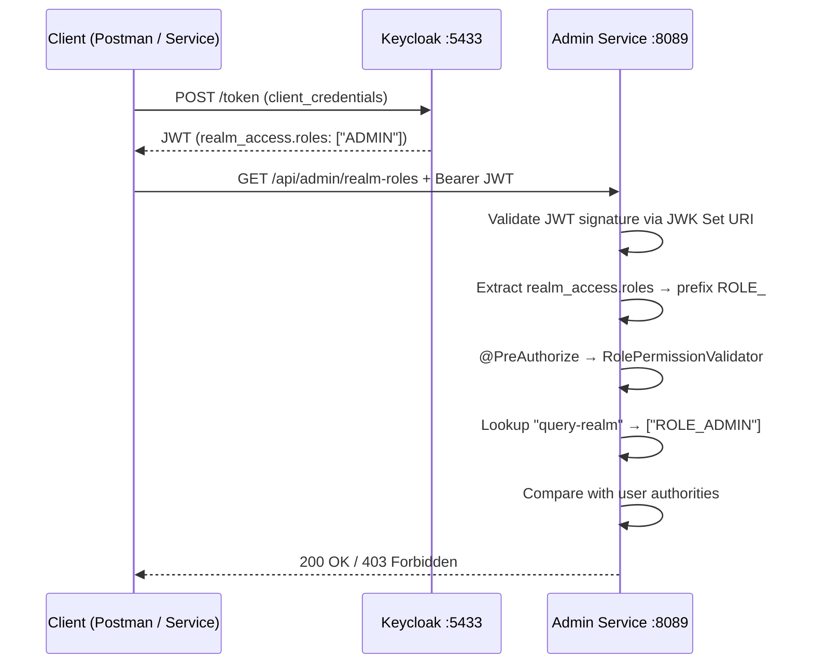

## Authentication Flow

The admin-service acts as an OAuth2 **Resource Server**. It never issues tokens — it validates JWTs issued by Keycloak.



---

## JWT Claims Processing

Keycloak tokens include roles under the `realm_access` claim:

```json {linenos=table, anchorlinenos=true}
{
  "realm_access": {
    "roles": ["ADMIN", "offline_access", "uma_authorization"]
  }
}
```

The `JwtAuthenticationConverter` in `SecurityConfig` maps each role to a Spring `GrantedAuthority` by prepending `ROLE_`:

```text {linenos=table, anchorlinenos=true}
"ADMIN"            → "ROLE_ADMIN"
"INTERNAL_SERVICE" → "ROLE_INTERNAL_SERVICE"
```

---

## Role-to-Operation Matrix


| Operation Key | Required Role | Endpoints |
|---|---|---|
| `create-client` | `ROLE_ADMIN` | `POST /api/admin/inter-service-clients` |
| `query-realm` | `ROLE_ADMIN` | `GET/POST /api/admin/realm-roles`, `GET /api/admin/realm-role` |
| `vault-ops` | `ROLE_ADMIN` | All `/api/admin/vault-*` endpoints |
| _(path-based)_ | `ROLE_INTERNAL_SERVICE` | `/internal/**` |
| ⚠️ _(missing)_ | None | `DELETE /api/admin/vault-secrets` |




---

## RolePermissionValidator

Bean name: `rolePermissionValidator`. This is the central enforcement point for operation-level RBAC across all controllers.

```java {linenos=table, anchorlinenos=true}
@Component
@RequiredArgsConstructor
public class RolePermissionValidator {

    private final ApiProperties apiProperties;

    public Boolean hasAnyRole(Authentication authentication, String operation) {
        List<String> allowedRoles = apiProperties.getApiRoles().get(operation);

        if (CommonUtils.isEmpty(allowedRoles)) return false;

        Set<String> userRoles = authentication.getAuthorities()
            .stream()
            .map(GrantedAuthority::getAuthority)
            .collect(Collectors.toSet());

        boolean hasRole = allowedRoles.stream().anyMatch(userRoles::contains);

        if (!hasRole) {
            throw new UnAuthorizedException("User does not have valid access for this operation");
        }
        return true;
    }
}
```

**Flow for `@PreAuthorize("@rolePermissionValidator.hasAnyRole(authentication, 'vault-ops')")`:**

1. Spring AOP intercepts the controller method call.
2. Evaluates the SpEL expression — calls `rolePermissionValidator.hasAnyRole(...)`.
3. The validator looks up `"vault-ops"` in `ApiProperties.apiRoles` → resolves to `["ROLE_ADMIN"]`.
4. Compares against the JWT-extracted `GrantedAuthority` set.
5. If no match: throws `UnAuthorizedException` (HTTP 403). If match: returns `true` and the call proceeds.

---

## @AllowedRoles Annotation

A meta-annotation that wraps the SpEL expression in a cleaner, declarative form:

```java {linenos=table, anchorlinenos=true}
@Target({ElementType.METHOD})
@Retention(RetentionPolicy.RUNTIME)
@PreAuthorize("@rolePermissionValidator.hasAnyRole(authentication, #allowedRoles.value())")
public @interface AllowedRoles {
    String value();
}
```

**Usage (intended):**
```java {linenos=table, anchorlinenos=true}
@AllowedRoles("vault-ops")
@GetMapping("/vault-approle")
public ResponseEntity<?> getAppRoles() { ... }
```



---

## Adding a New Operation Role

To protect a new endpoint with a custom role mapping, no code changes are required — only config:

**Step 1 — Add the operation mapping in `application.yaml`:**

```yaml {linenos=table, anchorlinenos=true}
security:
  api-roles:
    my-new-operation:
      - ROLE_ANALYST
      - ROLE_ADMIN
```

**Step 2 — Annotate the controller method:**

```java {linenos=table, anchorlinenos=true}
@PreAuthorize("@rolePermissionValidator.hasAnyRole(authentication, 'my-new-operation')")
@GetMapping("/my-endpoint")
public ResponseEntity<?> myEndpoint() { ... }
```

The validator reads the updated config at runtime — no restart required if using Spring Cloud Config with refresh scope.
