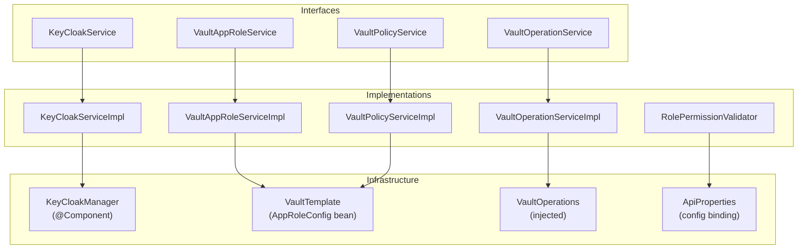
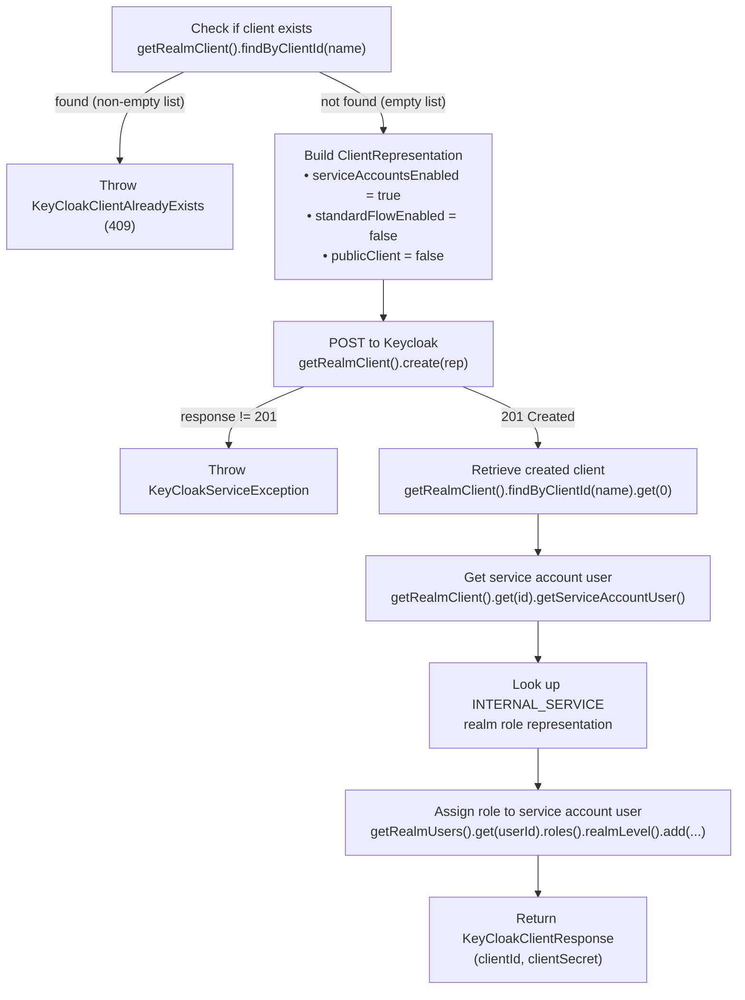
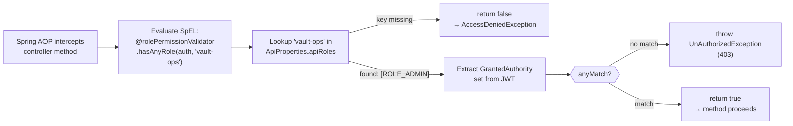

## Service Layer Overview

The admin-service has four service interfaces, four implementations, and one auxiliary component (`RolePermissionValidator`) that plugs into Spring Security.



All implementations are annotated with `@Service`, `@Transactional`, `@Slf4j`, and `@RequiredArgsConstructor` (Lombok-generated constructor injection).

---

## KeyCloakService Interface

```java {linenos=table, anchorlinenos=true}
public interface KeyCloakService {
    KeyCloakClientResponse createClient(String clientName);
    List<KeycloakRole> getRealmRoles();
    KeycloakRole getRealmRoleByName(String roleName);
    KeyCloakResponse createRealmRole(KeycloakRole keycloakRole);
}
```

---

## KeyCloakServiceImpl

### `createClient(String clientName)`

Creates a new confidential OAuth2 client for the service accounts flow and assigns the `INTERNAL_SERVICE` realm role to its service account.



**Key design choices:**
- `publicClient = false` makes the client confidential — it must present a `client_secret` to obtain tokens.
- `serviceAccountsEnabled = true` is what enables the `client_credentials` grant type.
- `standardFlowEnabled = false` disables the browser-based authorization code flow — this client is for machine-to-machine use only.
- The `INTERNAL_SERVICE` role assignment is what grants the new service access to `/internal/**` endpoints on other services.

---

### `createRealmRole(KeycloakRole keycloakRole)`

Uses a `try/catch` on `NotFoundException` to implement "check-then-create" logic. The Keycloak Admin Client throws `NotFoundException` when a role does not exist, which is the signal to proceed:

```java {linenos=table, anchorlinenos=true}
public KeyCloakResponse createRealmRole(KeycloakRole keycloakRole) {
    try {
        keyCloakManager.getRealmRoles()
            .get(keycloakRole.name())
            .toRepresentation();          // throws NotFoundException if absent
        throw new KeyCloakRealmRoleAlreadyExists(
            "Role already exists: " + keycloakRole.name());
    } catch (NotFoundException e) {
        RoleRepresentation role = keycloakRoleMapper.toEntity(keycloakRole);
        keyCloakManager.getKeyCloakInstanceWithRealm().roles().create(role);
        return new KeyCloakResponse(KEYCLOAK_ROLE_CREATED_200, "Role created");
    }
}
```



---

### `getRealmRoles()` and `getRealmRoleByName(String roleName)`

```java {linenos=table, anchorlinenos=true}
public List<KeycloakRole> getRealmRoles() {
    return keycloakRoleMapper.toDtoList(
        keyCloakManager.getRealmRoles().list()
    );
}

public KeycloakRole getRealmRoleByName(String roleName) {
    return keycloakRoleMapper.toDto(
        keyCloakManager.getRealmRoles().get(roleName).toRepresentation()
    );
}
```

Both delegate to `KeyCloakManager` accessors and pass the result through `KeycloakRoleMapper`.

---

## VaultAppRoleService Interface

```java {linenos=table, anchorlinenos=true}
public interface VaultAppRoleService {
    List<String> getAppRoles();
    VaultApiResponseDto getAppRole(String role);
    AppRoleResponseDto createAppRole(CreateAppRoleDto createAppRoleDto);
    VaultResponseDto deleteAppRole(String role);
    AppRoleResponseDto generateCredentials(String service);
}
```

---

## VaultAppRoleServiceImpl

Uses `VaultTemplate` injected from `AppRoleConfig`. All Vault paths are built as string constants.

### Path Constants

```java {linenos=table, anchorlinenos=true}
private static final String APPROLE_BASE   = "/auth/approle/role/";
private static final String APPROLE_PATH   = "/auth/approle/role/%s";
private static final String ROLE_ID_PATH   = "/auth/approle/role/%s/role-id";
private static final String SECRET_ID_PATH = "/auth/approle/role/%s/secret-id";
```

---

### `createAppRole(CreateAppRoleDto dto)`

```java {linenos=table, anchorlinenos=true}
public AppRoleResponseDto createAppRole(CreateAppRoleDto dto) {
    Map<String, Object> params = Map.of(
        "policies",       dto.policies(),
        "token_ttl",      "1h",
        "token_max_ttl",  "4h"
    );
    vaultTemplate.write(
        String.format(APPROLE_PATH, dto.roleName()), params);

    // Read back the generated role-id
    VaultResponse roleIdResponse = vaultTemplate.read(
        String.format(ROLE_ID_PATH, dto.roleName()));
    String roleId = (String) roleIdResponse.getData().get("role_id");

    // Generate a new secret-id
    VaultResponse secretIdResponse = vaultTemplate.write(
        String.format(SECRET_ID_PATH, dto.roleName()), Map.of());
    String secretId = (String) secretIdResponse.getData().get("secret_id");

    return new AppRoleResponseDto(roleId, secretId);
}
```



---

### `generateCredentials(String service)`

The credential rotation method. It reads the stable `role-id` (which does not change across rotations) and generates a brand-new `secret-id`, which implicitly invalidates the previous one if `secret_id_num_uses` was set to 1.

```java {linenos=table, anchorlinenos=true}
public AppRoleResponseDto generateCredentials(String service) {
    VaultResponse roleIdResponse = vaultTemplate.read(
        String.format(ROLE_ID_PATH, service));
    String roleId = (String) roleIdResponse.getData().get("role_id");

    VaultResponse secretIdResponse = vaultTemplate.write(
        String.format(SECRET_ID_PATH, service), Map.of());
    String secretId = (String) secretIdResponse.getData().get("secret_id");

    return new AppRoleResponseDto(roleId, secretId);
}
```

---

### `deleteAppRole(String role)`

```java {linenos=table, anchorlinenos=true}
public VaultResponseDto deleteAppRole(String role) {
    vaultTemplate.delete(String.format(APPROLE_PATH, role));
    return new VaultResponseDto("", "AppRole deleted");
}
```

Returns an empty `VaultResponseDto`. The empty `responseCode` is intentional — deletion does not carry a meaningful response body from Vault.

---

## VaultOperationService Interface

```java {linenos=table, anchorlinenos=true}
public interface VaultOperationService {
    VaultResponseDto createVaultSecret(VaultSecretDto dto);
    VaultResponseDto deleteVaultSecret(String service);
    Map<String, Object> getVaultSecret(String service);
    VaultResponseDto updateVaultSecret(VaultSecretDto dto);
}
```

---

## VaultOperationServiceImpl

Uses injected `VaultOperations` (the interface behind `VaultTemplate`) and builds a `VaultKeyValueOperations` handle per method call targeting the KV v2 `secret` backend.

### KV Handle Setup

```java {linenos=table, anchorlinenos=true}
private VaultKeyValueOperations kvOps() {
    return vaultOperations.opsForKeyValue(
        "secret",
        VaultKeyValueOperationsSupport.KeyValueBackend.KV_2
    );
}

private String secretPath(String service) {
    return "arya-banking/" + service + "/dev";
}
```

### Operations



{}
```java {linenos=table, anchorlinenos=true}
public VaultResponseDto createVaultSecret(VaultSecretDto dto) {
    kvOps().put(
        secretPath(dto.service()),
        Collections.singletonMap(dto.secretKey(), dto.secretValue())
    );
    return new VaultResponseDto(VAULT_SECRET_CREATED_200, "Secret created");
}
```

Writes a single key-value pair to the path. If other keys already exist at that path, they are **overwritten** — `put` replaces the entire data map. Use `updateVaultSecret` for a non-destructive merge.
{}

{}
```java {linenos=table, anchorlinenos=true}
public Map<String, Object> getVaultSecret(String service) {
    VaultValueResponse<Map<String, Object>> response =
        kvOps().get(secretPath(service));

    if (response == null || response.getData() == null ||
            response.getData().isEmpty()) {
        throw new VaultSecretNotFoundException(
            "No secrets found for service: " + service);
    }
    return response.getData();
}
```

Returns the full data map for the path. Throws `VaultSecretNotFoundException` (404) if the path is empty or does not exist.
{}

{}
```java {linenos=table, anchorlinenos=true}
public VaultResponseDto updateVaultSecret(VaultSecretDto dto) {
    kvOps().patch(
        secretPath(dto.service()),
        Collections.singletonMap(dto.secretKey(), dto.secretValue())
    );
    return new VaultResponseDto(VAULT_SECRET_UPDATED_200, "Secret updated");
}
```

Uses KV v2 `PATCH` semantics. Only the specified key is merged into the existing data — **other keys at the same path are preserved**. This is the safe way to update a single secret without affecting others.
{}

{}
```java {linenos=table, anchorlinenos=true}
public VaultResponseDto deleteVaultSecret(String service) {
    kvOps().delete(secretPath(service));
    return new VaultResponseDto(VAULT_SECRET_DELETED_200, "Secret deleted");
}
```

Deletes the **entire path** for the given service — all keys under `secret/arya-banking/{service}/dev` are removed. This is called by the `DELETE /api/admin/vault-secrets` endpoint which currently has no `@PreAuthorize` guard.
{}





---

## VaultPolicyService Interface

```java {linenos=table, anchorlinenos=true}
public interface VaultPolicyService {
    List<String> getPolicies();
    VaultResponseDto uploadPolicy(String service) throws IOException;
    VaultResponseDto deletePolicy(String service);
}
```

---

## VaultPolicyServiceImpl

Manages Vault ACL policies at `sys/policies/acl/`. Uses `VaultTemplate` directly (not the KV operations wrapper) because the policies endpoint is a system path, not a KV path.

### `getPolicies()`

```java {linenos=table, anchorlinenos=true}
public List<String> getPolicies() {
    return vaultTemplate.list("/sys/policies/acl/");
}
```

Returns a list of all policy names currently registered in Vault.

### `uploadPolicy(String service)`

```java {linenos=table, anchorlinenos=true}
public VaultResponseDto uploadPolicy(String service) throws IOException {
    String policyContent = commonUtils.loadConfig(service + "-policy.hcl");
    vaultTemplate.write(
        "/sys/policies/acl/" + service + "-policy",
        Map.of("policy", policyContent)
    );
    return new VaultResponseDto(VAULT_SECRET_CREATED_200, "Policy uploaded");
}
```

Resolves the policy file from the classpath using `CommonUtils.loadConfig(path)`, which reads the file as a UTF-8 string via `SpringContextHolder`. The file name convention is `{service}-policy.hcl`. Adding a new service policy requires only adding the `.hcl` file to `src/main/resources/` — no code changes.

### `deletePolicy(String service)`

```java {linenos=table, anchorlinenos=true}
public VaultResponseDto deletePolicy(String service) {
    vaultTemplate.delete("/sys/policies/acl/" + service + "-policy");
    return new VaultResponseDto(VAULT_SECRET_DELETED_200, "Policy deleted");
}
```



---

## RolePermissionValidator

**Bean name:** `rolePermissionValidator`  
**Referenced in:** All `@PreAuthorize` SpEL expressions across controllers.

This is not a service in the business-logic sense — it's a Spring Security integration component that bridges the `ApiProperties` config map with the JWT-extracted `GrantedAuthority` set.

```java {linenos=table, anchorlinenos=true}
@Component
@RequiredArgsConstructor
@Slf4j
public class RolePermissionValidator {

    private final ApiProperties apiProperties;

    public Boolean hasAnyRole(Authentication authentication, String operation) {
        List<String> allowedRoles = apiProperties.getApiRoles().get(operation);

        if (CommonUtils.isEmpty(allowedRoles)) {
            log.warn("No roles configured for operation: {}", operation);
            return false;
        }

        Set<String> userRoles = authentication.getAuthorities()
            .stream()
            .map(GrantedAuthority::getAuthority)
            .collect(Collectors.toSet());

        boolean hasRole = allowedRoles.stream().anyMatch(userRoles::contains);

        if (!hasRole) {
            throw new UnAuthorizedException(
                "User does not have valid access for this operation: " + operation);
        }
        return true;
    }
}
```

### Execution Path



### Error Response

When `UnAuthorizedException` is thrown, the `GlobalExceptionHandler` in `arya-banking-common` intercepts it and returns:

```json {linenos=table, anchorlinenos=true}
{
  "errorCode": "ADMIN_UN_AUTHORIZED_EXCEPTION_403",
  "errorMessage": "User does not have valid access for this operation: vault-ops"
}
```

with HTTP status `403 Forbidden`.
