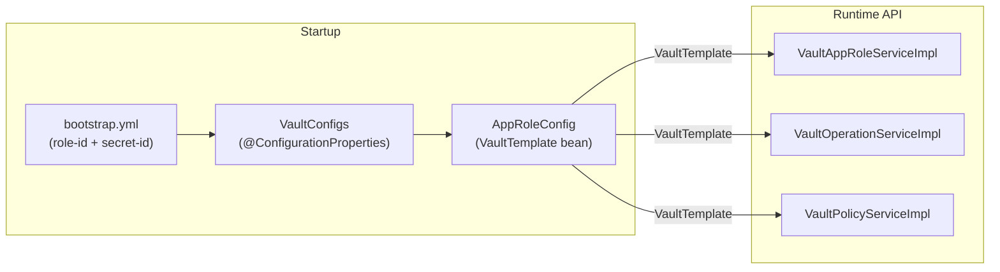

## Overview

The admin-service has a dual relationship with Vault:

- **As a consumer** — It authenticates to Vault using AppRole at startup to read its own secrets (e.g., `ADMIN_SERVICE_CLIENT_SECRET`).
- **As an administrator** — It exposes REST endpoints that allow operators to manage Vault AppRoles, KV secrets, and ACL policies for other services.



---

## AppRole Bootstrap

On application startup, Spring Cloud Vault reads `bootstrap.yml` and authenticates to Vault:

```yaml {linenos=table, anchorlinenos=true}
cloud:
  vault:
    uri: http://localhost:8091
    authentication: APPROLE
    app-role:
      role-id: <role-id>
      secret-id: <secret-id>
    kv:
      enabled: true
      backend: secret
      application-name: arya-banking/admin-service
      profile-separator: /
```

Spring resolves secrets from the path: `secret/data/arya-banking/admin-service/dev`

The `AppRoleConfig` bean additionally builds a standalone `VaultTemplate` using the same credentials. This template is used by all three `Vault*ServiceImpl` classes for programmatic Vault operations.

---

## VaultAppRoleServiceImpl

Manages AppRoles in Vault's `auth/approle/` mount.

### Path Constants

```java {linenos=table, anchorlinenos=true}
APPROLE_BASE = "/auth/approle/role/"
APPROLE_PATH = "/auth/approle/role/{roleName}"
ROLE_PATH    = "/auth/approle/role/{roleName}/role-id"
SECRET_PATH  = "/auth/approle/role/{roleName}/secret-id"
```

### Operations


| Method | Vault Call | Returns |
|---|---|---|
| `getAppRoles()` | `vaultTemplate.list(APPROLE_BASE)` | `List<String>` of role names |
| `getAppRole(role)` | `vaultTemplate.read(APPROLE_PATH)` | `VaultApiResponseDto` |
| `createAppRole(dto)` | `vaultTemplate.write(APPROLE_PATH)` | `AppRoleResponseDto` (roleId + secretId) |
| `deleteAppRole(role)` | `vaultTemplate.delete(APPROLE_PATH)` | `VaultResponseDto` |
| `generateCredentials(service)` | read role-id + write secret-id | `AppRoleResponseDto` |


### AppRole Creation

When creating an AppRole, the service writes the following parameters to Vault:

```java {linenos=table, anchorlinenos=true}
Map<String, Object> params = Map.of(
    "policies",       createAppRoleDto.policies(),
    "token_ttl",      "1h",
    "token_max_ttl",  "4h"
);
vaultTemplate.write("/auth/approle/role/" + roleName, params);
```

After writing, it reads back the generated `role-id` and generates a `secret-id` in separate calls, returning both in the `AppRoleResponseDto`.

### Credential Rotation

The `generateCredentials(service)` method is the standard rotation mechanism. It reads the existing `role-id` (which does not change) and generates a **new** `secret-id`, invalidating the old one:

```bash {linenos=table, anchorlinenos=true}
# Via API
curl "http://localhost:8089/api/admin/vault-approle/secrets?appRole=user-service" \
  -H "Authorization: Bearer <token>"
```

---

## VaultOperationServiceImpl

Manages KV v2 secrets for all services under `secret/arya-banking/`.

### Secret Path Pattern

```text {linenos=table, anchorlinenos=true}
secret/arya-banking/{service}/dev
```

Each service has an isolated path. The admin-service is the only actor with write access.

### Operations

```java {linenos=table, anchorlinenos=true}
// Builds a KV v2 operations handle on each call
VaultKeyValueOperations kvOps = vaultOperations
    .opsForKeyValue("secret", VaultKeyValueOperationsSupport.KeyValueBackend.KV_2);

String path = "arya-banking/" + service + "/dev";
```


| Method | KV v2 Operation | Notes |
|---|---|---|
| `createVaultSecret` | `kvOps.put(path, singletonMap(key, value))` | Creates or overwrites the secret |
| `getVaultSecret` | `kvOps.get(path)` | Throws `VaultSecretNotFoundException` if empty |
| `updateVaultSecret` | `kvOps.patch(path, singletonMap(key, value))` | KV v2 PATCH — merges into existing data |
| `deleteVaultSecret` | `kvOps.delete(path)` | Deletes the entire path |




---

## VaultPolicyServiceImpl

Manages Vault ACL policies under `sys/policies/acl/`.

### Policy File Convention

HCL policy files are stored as classpath resources:

```text {linenos=table, anchorlinenos=true}
src/main/resources/
├── admin-service-policy.hcl
└── user-service-policy.hcl
```

The file is loaded via `CommonUtils.loadConfig("{service}-policy.hcl")` which reads it as a UTF-8 string from the classpath using `SpringContextHolder`.

### Upload Flow

```java {linenos=table, anchorlinenos=true}
public VaultResponseDto uploadPolicy(String service) throws IOException {
    String policyContent = commonUtils.loadConfig(service + "-policy.hcl");
    Map<String, String> body = Map.of("policy", policyContent);
    vaultTemplate.write("/sys/policies/acl/" + service + "-policy", body);
    return new VaultResponseDto(VAULT_SECRET_CREATED_200, "Policy uploaded");
}
```

---

## HCL Policies

### admin-service-policy.hcl

The broadest policy — grants full CRUD to the admin-service across all secrets and the AppRole system.

```hcl {linenos=table, anchorlinenos=true}
# Full access to all arya-banking KV secrets
path "secret/data/arya-banking/*" {
  capabilities = ["create", "read", "update", "delete", "patch"]
}
path "secret/metadata/arya-banking/*" {
  capabilities = ["read", "delete"]
}

# AppRole management
path "auth/approle/role/*" {
  capabilities = ["create", "read", "update", "delete", "list"]
}
path "auth/approle/role/*/secret-id" {
  capabilities = ["create", "read"]
}
path "auth/approle/role/*/role-id" {
  capabilities = ["read"]
}

# System auth management
path "sys/auth/*" {
  capabilities = ["create", "update", "read"]
}

# Policy management
path "sys/policies/acl/*" {
  capabilities = ["create", "read", "update", "delete", "list"]
}
```

### user-service-policy.hcl

Minimal, read-only policy scoped to the user-service secret path.

```hcl {linenos=table, anchorlinenos=true}
path "secret/data/arya-banking/user-service" {
  capabilities = ["read"]
}
path "secret/data/arya-banking/user-service/*" {
  capabilities = ["read"]
}
path "secret/metadata/arya-banking/user-service" {
  capabilities = ["read"]
}
path "secret/metadata/arya-banking/user-service/*" {
  capabilities = ["read"]
}
```

Upload it with:

```bash {linenos=table, anchorlinenos=true}
curl -X POST "http://localhost:8089/api/admin/vault/policies?service=user-service" \
  -H "Authorization: Bearer <token>"
```

{{< alert context="info" text="Adding a policy for a new service is as simple as adding a {service}-policy.hcl file to src/main/resources/ and calling the upload endpoint. No code changes are needed." />}}
