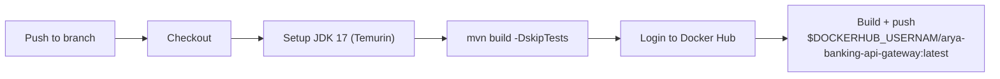

## GitHub Actions Workflows

One workflow is defined under `.github/workflows/`.

---

### docker-publish.yml — Container Image

**Trigger:** Push to the default branch.



**Key details:**
- Builds the JAR with JDK 17 (Temurin) and `mvn build -DskipTests`.
- Logs in to **Docker Hub** using the `DOCKERHUB_USERNAM` and `DOCKERHUB_TOKEN` secrets.
- Publishes the image as `${DOCKERHUB_USERNAM}/arya-banking-api-gateway:latest`.



---

## Dockerfile

The gateway uses a multi-stage Dockerfile: a Maven build stage producing the fat JAR, followed by a slim JRE runtime stage.

```dockerfile {linenos=table, anchorlinenos=true}
# Stage 1 — Build
FROM maven:3.9.4-eclipse-temurin-17 AS build
WORKDIR /workspace
COPY settings.xml .
COPY pom.xml .
RUN mvn -B dependency:go-offline -s settings.xml
COPY src ./src
RUN mvn -B -DskipTests clean package -s settings.xml

# Stage 2 — Runtime
FROM eclipse-temurin:17-jre-jammy
RUN apt-get update && apt-get install -y --no-install-recommends curl \
  && rm -rf /var/lib/apt/lists/*
COPY --from=build /workspace/target/*.jar /app/app.jar

EXPOSE 8085
ENTRYPOINT ["java","-jar","/app/app.jar"]
```

- **Build stage:** `maven:3.9.4-eclipse-temurin-17` — resolves dependencies via `settings.xml` so the private `arya-banking-common` artifact can be fetched from GitHub Packages.
- **Runtime stage:** `eclipse-temurin:17-jre-jammy` with `curl` installed for container health checks.
- **Exposed port:** `8085` (the gateway's HTTP port).
- **Entrypoint:** `java -jar /app/app.jar`.

The repository-level `settings.xml` maps the GitHub Packages registry as server id `github`:

```xml {linenos=table, anchorlinenos=true}
<settings>
  <servers>
    <server>
      <id>github</id>
      <username>${env.GITHUB_ACTOR}</username>
      <password>${env.GH_PAT}</password>
    </server>
  </servers>
</settings>
```

---

## Required Secrets


| Secret | Purpose |
|---|---|
| `DOCKERHUB_USERNAM` | Docker Hub username for image pushes |
| `DOCKERHUB_TOKEN` | Docker Hub access token |
| `GH_PAT` | GitHub Packages access for private Maven dependencies |

