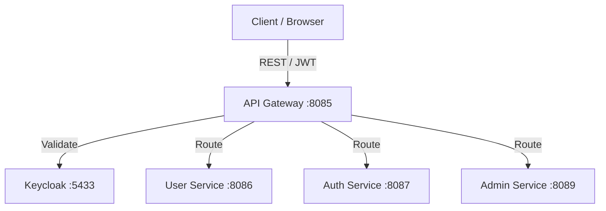

## Introduction

The `arya-banking-api-gateway` is the **single entry point** for all external and internal HTTP traffic in the Arya Banking platform. Built on **Spring Cloud Gateway**, it operates as a reactive proxy that handles request routing, load balancing, and cross-cutting security concerns.

---

## Core Responsibilities

The gateway performs five critical functions:


| Function | Mechanism |
|---|---|
| **Request Routing** | Path-predicate-based routing to downstream microservices via Config Server + Eureka `lb://` |
| **JWT Authentication** | Resource server validation for tokens issued by Keycloak. |
| **Access Control** | Route-level authorization (public vs. authenticated vs. internal). |
| **API Docs Aggregation** | Swagger UI at `/swagger-ui.html` proxies `/admin-service/v3/api-docs`, `/auth-service/v3/api-docs`, `/user-service/v3/api-docs` via `lb://` routes. |
| **Correlation ID Propagation** | Extracts or generates `X-Correlation-ID` header and propagates it downstream for distributed tracing. |


---

## Swagger UI

The gateway aggregates OpenAPI docs from all downstream services. Access the unified Swagger UI at:

```text
http://localhost:8085/swagger-ui.html
```

The gateway proxies API doc requests to each service via Eureka service discovery (`lb://`):

```yaml
# Routes defined in arya-banking-configs/application.yml
- id: admin-service-api-docs
  uri: lb://arya-banking-admin-service
  predicates:
    - Path=/admin-service/v3/api-docs
  filters:
    - RewritePath=/admin-service/v3/api-docs, /v3/api-docs
```



---

## Dockerized Deployment

The API Gateway is deployed as a Docker container as part of the platform stack. It is defined in `compose/platform.yml` alongside the Service Registry and Config Server.

- **Image**: `karthikulkarni/arya-banking-api-gateway:latest`
- **Container Name**: `api-gateway`
- **Host Port**: `8085` &rarr; Container `8085`
- **Network**: `arya-banking-net`

) page for the full platform stack definition." />}}

---

## Reactive Architecture

Unlike traditional servlet-based Spring Boot applications, the API Gateway is built on **Spring WebFlux**.



---

## Dual OAuth2 Role

The gateway is uniquely configured to act in two capacities simultaneously:

1.  **OAuth2 Client**: Initiates the Authorization Code flow (using Keycloak) for browser-based login redirects.
2.  **OAuth2 Resource Server**: Validates the Bearer JWT on every incoming API request using RS256 asymmetric keys.

---

## Correlation ID Propagation (`CorrelationIdGlobalFilter`)

The gateway implements a global `WebFilter` (`CorrelationIdGlobalFilter`) at `HIGHEST_PRECEDENCE` to ensure every request carries a correlation ID for distributed tracing:

### Behavior
1. **Extract**: Reads `X-Correlation-ID` from incoming request headers
2. **Generate**: If absent, generates a new UUID v4
3. **Propagate**: Adds header to downstream request via `ServerHttpRequest.mutate()`
4. **Response**: Echoes correlation ID in response headers
5. **Context**: Stores in Reactor context for logging/access in downstream filters

### Implementation
```java
@Component
@Order(Ordered.HIGHEST_PRECEDENCE)
public class CorrelationIdGlobalFilter implements WebFilter {

    public static final String CORRELATION_ID_HEADER = "X-Correlation-ID";

    @Override
    public Mono<Void> filter(ServerWebExchange exchange, WebFilterChain chain) {
        ServerHttpRequest request = exchange.getRequest();
        String correlationId = request.getHeaders().getFirst(CORRELATION_ID_HEADER);
        if (null == correlationId || correlationId.isBlank()) {
            correlationId = UUID.randomUUID().toString();
        }

        ServerHttpRequest mutatedRequest = request.mutate()
                .header(CORRELATION_ID_HEADER, correlationId).build();

        ServerWebExchange mutatedExchange = exchange.mutate()
                .request(mutatedRequest).build();

        mutatedExchange.getResponse()
                .getHeaders().add(CORRELATION_ID_HEADER, correlationId);

        String finalCorrelationId = correlationId;
        return chain.filter(mutatedExchange)
                .contextWrite(ctx -> ctx.put(CORRELATION_ID_HEADER, finalCorrelationId));
    }
}
```

### Integration with Services
- **Downstream services** read `X-Correlation-ID` from headers
- **Auth Service / User Service** set it in `CorrelationIdContext` (MDC + thread-local) via `arya-banking-common`
- **Kafka events** include `correlationId` in `EventMetadata` for end-to-end traceability

---

## Request Flow


