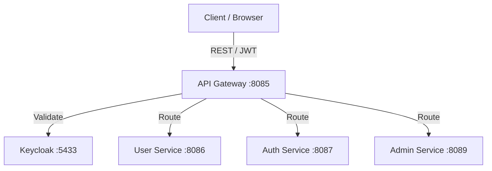

## Introduction

The `arya-banking-api-gateway` is the **single entry point** for all external and internal HTTP traffic in the Arya Banking platform. Built on **Spring Cloud Gateway**, it operates as a reactive proxy that handles request routing, load balancing, and cross-cutting security concerns.

---

## Core Responsibilities

The gateway performs three critical functions:


| Function | Mechanism |
|---|---|
| **Request Routing** | Path-predicate-based routing to downstream microservices. |
| **JWT Authentication** | Resource server validation for tokens issued by Keycloak. |
| **Access Control** | Route-level authorization (public vs. authenticated vs. internal). |


---

## Dockerized Deployment

The API Gateway is deployed as a Docker container as part of the platform stack. It is defined in `compose/platform.yml` alongside the Service Registry and Config Server.

- **Image**: `karthikulkarni/arya-banking-api-gateway:latest`
- **Container Name**: `api-gateway`
- **Host Port**: `8085` &rarr; Container `8085`
- **Network**: `arya-banking-net`

) page for the full platform stack definition." />}}

---

## Reactive Architecture

Unlike traditional servlet-based Spring Boot applications, the API Gateway is built on **Spring WebFlux**.



---

## Dual OAuth2 Role

The gateway is uniquely configured to act in two capacities simultaneously:

1.  **OAuth2 Client**: Initiates the Authorization Code flow (using Keycloak) for browser-based login redirects.
2.  **OAuth2 Resource Server**: Validates the Bearer JWT on every incoming API request using RS256 asymmetric keys.

---

## Request Flow

