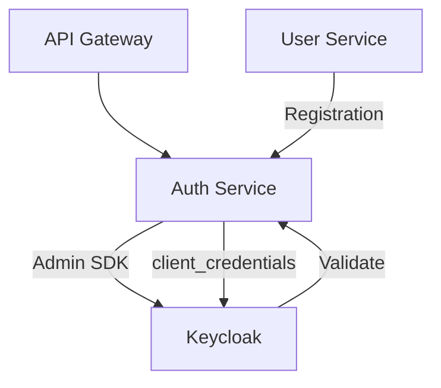
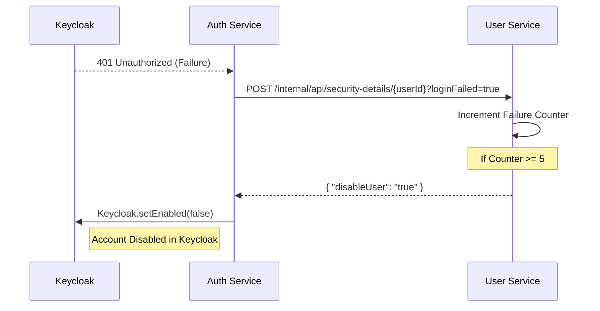

## System Overview

The `arya-banking-auth-service` resides at the core of the Arya Banking platform, facilitating communication between the rest of the services and Keycloak.

---

## Authentication Flow

### Public API Authentication
When a user attempts to log in, the following flow is executed:

1.  The client sends credentials to the Gateway.
2.  The Gateway routes the request to `/api/auth/authenticate`.
3.  The Auth Service validates the credentials via a `password` grant to Keycloak.
4.  If successful, the JWT is returned to the client.

### Cross-Service Account Lock
A critical part of the architecture is the **account lock synchronization** between the User Service and Keycloak:

---

## Technical Components

- **Keycloak Admin SDK**: Used to perform administrative actions (e.g., user creation and account status updates).
- **RestTemplate (Pooled)**: High-performance HTTP client for token exchanges.
- **Feign Clients**: Manage communication with the User Service for account security synchronization.
- **Resource Server**: Validates incoming JWTs for internal service-to-service calls.
