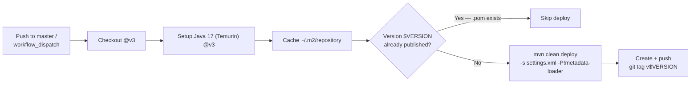

## GitHub Actions Workflows

One workflow is defined under `.github/workflows/`.

---

### deploy.yml — Build & Release

**Trigger:** Push to `master` branch, or manual `workflow_dispatch`.



**Key details:**

- **Checkout & Toolchain:** Uses `actions/checkout@v3` and `actions/setup-java@v3` with **Temurin 17**, including Maven repository caching for `~/.m2/repository`.
- **Idempotent Publish:** Before deploying, the workflow checks whether `$VERSION` is already published by probing:

  ```
  https://maven.pkg.github.com/Event-Based-Banking-Application/arya-banking-maven-registry/$GROUP/$ARTIFACT/$VERSION/$ARTIFACT-$VERSION.pom
  ```

  where `$GROUP` is the group ID with dots converted to slashes (e.g., `org/arya/banking`). If the `.pom` responds with HTTP 200, the deploy step is **skipped**.
- **Deploy:** Runs `mvn clean deploy -s settings.xml -P!metadata-loader` authenticated against **GitHub Packages** with the `GH_PAT` secret.
- **Version Tag:** Creates and pushes the git tag `v$VERSION` derived from `pom.xml`.

---

## Metadata Loader & CI

The `exec-maven-plugin` binds the **metadata loader** profile to the `install` phase and activates it **by default** for local builds. It connects to Vault and MongoDB to version the database schema metadata at build time.

Since CI has no access to Vault or MongoDB, the deploy workflow explicitly skips it:

```bash
mvn clean deploy -s settings.xml -P!metadata-loader
```



---

## Maven Settings (`settings.xml`)

A `settings.xml` at the repo root wires GitHub Packages authentication for both build and deploy:

```xml {linenos=table, anchorlinenos=true}
<settings>
  <servers>
    <server>
      <id>github</id>
      <username>${env.GITHUB_ACTOR}</username>
      <password>${env.GH_PAT}</password>
    </server>
  </servers>
</settings>
```

The `${env.GITHUB_ACTOR}` and `${env.GH_PAT}` placeholders are resolved from workflow environment variables, keeping credentials out of the repository.
