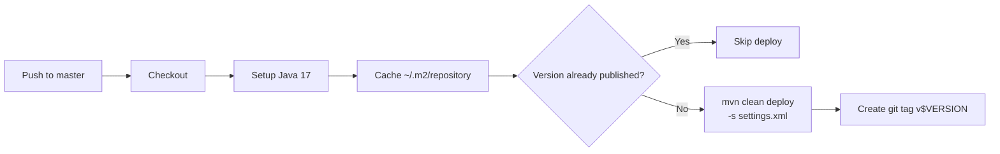

## Reactor Build

`arya-banking-common` is a multi-module Maven reactor. The parent POM at the repo root builds five modules:

```
arya-banking-common/
├── pom.xml              ← reactor parent (packaging: pom)
├── core/                ← domain models, exceptions, DTOs
├── mongo/               ← MongoDB configuration
├── kafka/               ← Kafka config + Avro schemas
├── feign/               ← Feign client config
└── oauth2/              ← OAuth2 client credentials config
```

Each module has its own `pom.xml` with a minimal set of dependencies. The reactor parent manages shared properties, plugin versions, and dependency BOMs (Spring Boot, Spring Cloud).

---

## GitHub Actions Workflows

### deploy.yml — Build & Deploy All Modules

**Trigger:** Push to `master` branch, or manual `workflow_dispatch`.



**Key details:**

- **Multi-module deploy**: `mvn clean deploy` publishes all five modules (`core`, `mongo`, `kafka`, `feign`, `oauth2`) in a single pass.
- **Idempotent**: Checks whether the version is already published before deploying.
- **Tag**: Creates and pushes `v$VERSION` derived from the parent `pom.xml`.

---

## Maven Settings (`settings.xml`)

A `settings.xml` at the repo root wires GitHub Packages authentication:

```xml
<settings>
  <servers>
    <server>
      <id>github</id>
      <username>${env.GITHUB_ACTOR}</username>
      <password>${env.GH_PAT}</password>
    </server>
  </servers>
</settings>
```

The `${env.GITHUB_ACTOR}` and `${env.GH_PAT}` placeholders are resolved from workflow environment variables, keeping credentials out of the repository.

---

## Local Build

```bash
mvn clean install       # build all 5 modules locally
mvn clean install -pl core -am   # build only core + its dependencies
```
