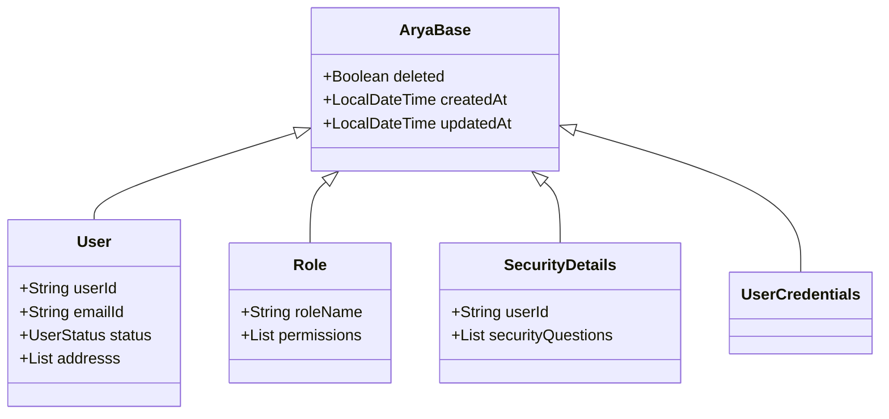

## Model Hierarchy

All major entities in the platform extend a shared base class for auditing and soft-deletion consistency.

---

## 1. AryaBase (The Foundation)

Every root document extends `AryaBase`, providing:
* **Soft Delete**: Uses a `deleted` boolean flag instead of destructive removal.
* **Auditing**: Auto-populated `createdAt` and `updatedAt` timestamps.

---

## 2. Core Entities

### User (`user` collection)
The central entity for banking users.
* **Fields**: `firstName`, `lastName`, `emailId`, `primaryContactNumber`, `status`.
* **Typos to Note**: The field for addresses is named `addresss` (triple 's').

### Role (`role` collection)
Defines platform permissions.
* **Permissions**: Each role contains a list of modules (`USERS`, `ACCOUNTS`, etc.) and permitted actions (`READ`, `WRITE`, `DELETE`).

### SecurityDetails (`security_details` collection)
Manages sensitive identity verification.
* **Features**: Security questions, 2FA toggles, and login failure tracking for account lockout logic.

---

## 3. Registration Flow Constants

The library provides `RegistrationConstants` to manage the multi-step signup process:


| Step | Action | Next Step |
|---|---|---|
| **1** | `BASIC_DETAILS_ADDED` | `ADD_ADDRESS` |
| **2** | `ADDRESS_ADDED` | `ADD_SECURITY_CREDENTIALS` |
| **3** | `SECURITY_CREDENTIALS_ADDED` | _Complete_ |


---

## 4. Enums

* **`UserStatus`**: `ACTIVE`, `BLOCKED`, `DORMANT`.
* **`AddressType`**: `PERMANENT`, `RESIDENTIAL`.
* **`Modules`**: `USERS`, `ACCOUNTS`, `TRANSACTIONS`, `LOANS`.
