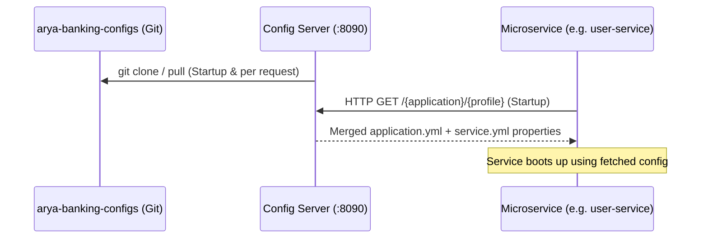

## End-to-End Config Flow

Config Server serves properties to all microservices at startup. Microservices never read active configs from their own JAR in production; they retrieve them dynamically via the config server.



## Dockerized Platform Stack

The Config Server runs as a Docker container in the platform stack. The `compose/platform.yml` configures it with health checks against `/actuator/health` and an environment override for the Eureka URL:

```yaml
config-server:
  image: karthikulkarni/arya-banking-config-server:latest
  ports:
    - "8090:8090"
  environment:
    EUREKA_CLIENT_SERVICEURL_DEFAULTZONE: http://service-registry:8761/eureka/
  depends_on:
    service-registry:
      condition: service_started
  healthcheck:
    test: ["CMD", "curl", "-f", "http://localhost:8090/actuator/health"]
```

) page for the full platform.yml details." />}}

---

## Startup Order

Since services depend on remote properties to connect to databases and message brokers, the startup order is critical:

1. **Service Registry (`8761`)**: Must start first to allow discovery.
2. **Config Server (`8090`)**: Registers with Eureka, clones the Git repo, and begins serving configs.
3. **All other Microservices**: Fetch their configs from `8090`, then self-register with `8761`.
