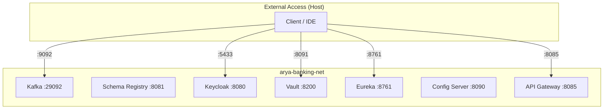

## Infrastructure Stacks

The Arya Banking platform is orchestrated via four modular Docker Compose files located in the `compose/` directory of `arya-banking-infra`. All services join the external `arya-banking-net` network.

---

## 1. Event Streaming (`kafka.yml`)

Provides the Apache Kafka backbone for event-driven communication.




| Service | Image | Host Port | Healthcheck |
|---|---|---|---|
| **Kafka** | `confluentinc/cp-kafka:latest` | `9092` (external) / `29092` (internal) | `kafka-broker-api-versions` (10s/10s, 10 retries, 30s start) |
| **Schema Registry** | `confluentinc/cp-schema-registry:latest` | `8081` | — |
| **Kafka Connect** | `confluentinc/cp-kafka-connect:latest` | `8083` | — |
| **Kafka UI (Kafbat)** | `ghcr.io/kafbat/kafka-ui:latest` | `8080` | — |


### Listener Architecture
Kafka is configured with multiple listeners to support both internal (container) and external (host) clients:
* **`PLAINTEXT_INTERNAL`**: `kafka:29092` (used by Docker microservices)
* **`PLAINTEXT_EXTERNAL`**: `localhost:9092` (used for local IDE debugging)
* **`CONTROLLER`**: `kafka:9093` (KRaft controller quorum, single node `1@kafka:9093`)

### Kafka Connect
* Group: `compose-connect-group`
* Internal topics: `_connect_configs`, `_connect_offset`, `_connect_status` (RF=1)
* Key/Value converters: `StringConverter` (external), `JsonConverter` (internal)
* Schema Registry URL: `http://schema-registry:8081`

### Kafka UI (Kafbat)
* Cluster name: `banking-local`, Schema Registry + Kafka Connect linked
* URL: `http://localhost:8080`

### Volumes
`kafka-data` (`/var/lib/kafka/data`), `schema-data`, `pgdata` (named volumes).

---

## 2. Identity & Access (`keycloak.yml`)

Handles Authentication and Authorization via Keycloak 26.


| Service | Image | Host Port | Notes |
|---|---|---|---|
| **PostgreSQL** | `postgres:15` | `5432` | DB/user/pass: `keycloak`/`keycloak`/`keycloakpass` |
| **Keycloak** | `quay.io/keycloak/keycloak:26.0.2` | `5433` → `8080` | `start-dev` mode, admin/admin bootstrap |


{}
Keycloak is configured with **Argon2id** password hashing by default. This is the current OWASP-recommended algorithm for secure credential storage.
{}

### Volumes & Data
* `postgres-data` (host bind `./postgres-data`) — PostgreSQL persistence
* `keycloak-data` (host bind `./keycloak-data`) — realm export/import artifacts

---

## 3. Secrets Management (`vault.yml`)

Secures sensitive configuration (DB passwords, client secrets) using HashiCorp Vault.

* **Image**: `hashicorp/vault:1.21`
* **Mode**: File storage (`vault server -config=vault/config/vault.hcl`), `ui = true`, `tls_disable = 1`
* **UI**: Enabled at `http://localhost:8091/ui`
* **Port**: `8091` -> `8200`
* **Capabilities**: `cap_add: IPC_LOCK`
* **Volumes**: `./vault/data`, `./vault/config`



---

## 4. Platform Services (`platform.yml`)

Orchestrates the Spring Cloud infrastructure components (images published to Docker Hub as `karthikulkarni/arya-banking-*`).


| Service | Image | Port | Healthcheck / Depends |
|---|---|---|---|
| **Service Registry** | `karthikulkarni/arya-banking-service-registry:latest` | `8761` | restart `unless-stopped` |
| **Config Server** | `karthikulkarni/arya-banking-config-server:latest` | `8090` | `curl -f localhost:8090/actuator/health` (10s/5s/5 retries) |
| **API Gateway** | `karthikulkarni/arya-banking-api-gateway:latest` | `8085` | waits for config-server healthy |


### Environment Variables


| Service | Variable | Value |
|---|---|---|
| Config Server | `SPRING_PROFILES_ACTIVE` | `default` |
| Config Server | `EUREKA_CLIENT_SERVICEURL_DEFAULTZONE` | `http://service-registry:8761/eureka/` |
| API Gateway | `SPRING_CLOUD_CONFIG_URI` | `http://config-server:8090` |
| API Gateway | `APP_CONFIG_KEYCLOAK_URL` | `http://keycloak:8080` |
| API Gateway | `EUREKA_CLIENT_SERVICEURL_DEFAULTZONE` | `http://service-registry:8761/eureka/` |


---

## Network Map

All services are joined to the `arya-banking-net` network:

