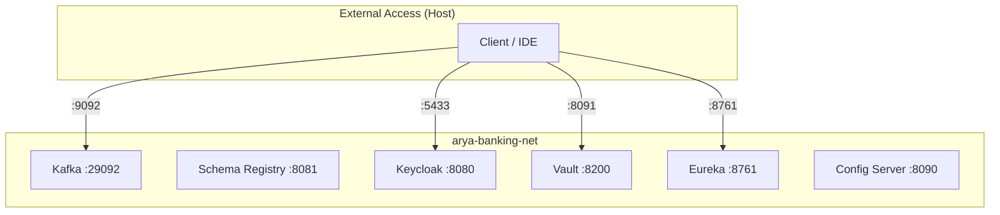

## Infrastructure Stacks

The Arya Banking platform is orchestrated via four modular Docker Compose files located in the `compose/` directory.

---

## 1. Event Streaming (`kafka.yml`)

Provides the Apache Kafka backbone for event-driven communication.




| Service | Image | Internal Port | Host Port |
|---|---|---|---|
| **Kafka** | `cp-kafka` | `29092` | `9092` |
| **Schema Registry** | `cp-schema-registry` | `8081` | `8081` |
| **Kafka Connect** | `cp-kafka-connect` | `8082` | `8082` |


### Listener Architecture
Kafka is configured with multiple listeners to support both internal (container) and external (host) clients:
* **`PLAINTEXT_INTERNAL`**: `kafka:29092` (Used by Docker microservices)
* **`PLAINTEXT_EXTERNAL`**: `localhost:9092` (Used for local IDE debugging)

---

## 2. Identity & Access (`keycloak.yml`)

Handles Authentication and Authorization via Keycloak.


| Service | Image | Internal Port | Host Port |
|---|---|---|---|
| **PostgreSQL** | `postgres:15` | `5432` | `5432` |
| **Keycloak** | `keycloak:26.0.2` | `8080` | `5433` |


{}
Keycloak is configured with **Argon2id** password hashing by default. This is the current OWASP-recommended algorithm for secure credential storage.
{}

---

## 3. Secrets Management (`vault.yml`)

Secures sensitive configuration (DB passwords, client secrets) using HashiCorp Vault.

* **Mode**: Filesystem storage (Dev mode)
* **UI**: Enabled at `http://localhost:8091/ui`
* **Port**: `8091` -> `8200`



---

## 4. Platform Services (`platform.yml`)

Orchestrates the Spring Cloud infrastructure components.


| Service | Image | Port | Description |
|---|---|---|---|
| **Service Registry** | `arya-banking-service-registry` | `8761` | Eureka Server |
| **Config Server** | `arya-banking-config-server` | `8090` | Spring Cloud Config |


---

## Network Map

All services are joined to the `arya-banking-net` network:

