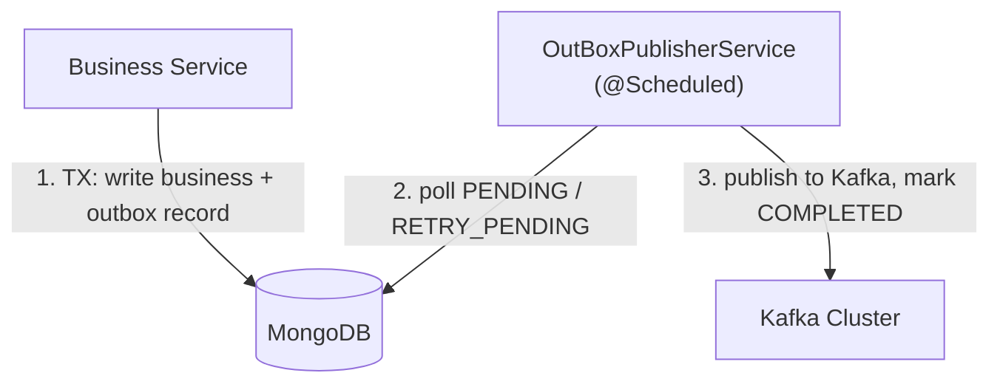
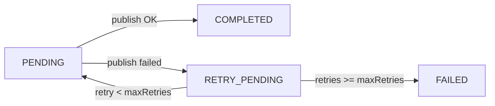

## System Flow

1. A business write and its outbox record are committed **in the same Mongo transaction**.
2. `OutBoxPublisherService` polls records in `PENDING` / `RETRY_PENDING` status on a fixed delay.
3. Records are published to Kafka via the `OutboxEventProducer`; success marks them `COMPLETED`.

---

## Components


| Component | Responsibility |
|---|---|
| `OutboxAutoConfiguration` | Registers `KafkaTemplate<String,OutboxKafkaEvent>`, `OutboxEventProducer`, and `@EnableScheduling`. Conditional on `arya.outbox.enabled=true`. Registered via `META-INF/spring/org.springframework.boot.autoconfigure.AutoConfiguration.imports`. |
| `OutboxProperties` | `@ConfigurationProperties("arya.outbox")` — interval, retries, enable flag. |
| `OutBoxPublisherService<T>` | Generic relay. `@Scheduled(fixedDelayString = "${arya.outbox.publish-interval-ms:5000}")`. `publishPendingAndRetry()` fetches `findByOutboxStatusIn([PENDING, RETRY_PENDING])`, sends via the producer **keyed by `aggregateId`**. Success → `COMPLETED`; exception → `RETRY_PENDING`. `handleEventUpdate` increments `retryCount` and marks `FAILED` when retries reach `maxRetries`. |
| `OutboxEventProducer` | Thin wrapper around `KafkaTemplate<String,OutboxKafkaEvent>`. |
| `OutboxEventRepository<T>` | `@NoRepositoryBean` MongoRepository contract exposing `findByOutboxStatusIn(...)`. |


---

## Status Lifecycle

- The producer **keys messages by `aggregateId`**, so all events for one aggregate land in the same Kafka partition — preserving per-aggregate ordering.
- Retries are bounded: a record loops `PENDING ↔ RETRY_PENDING` until `retryCount` hits `maxRetries`, then becomes `FAILED`.


