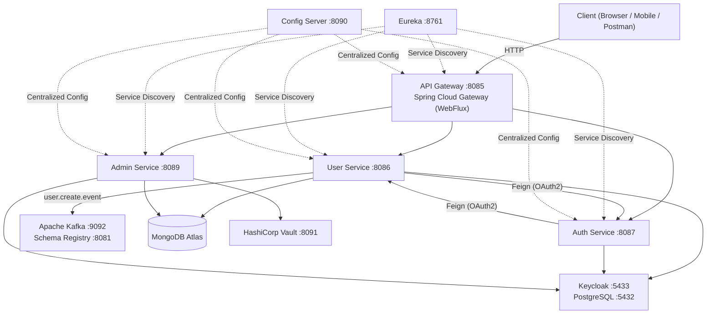
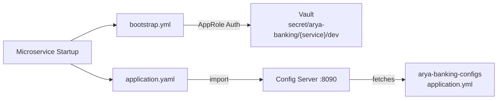
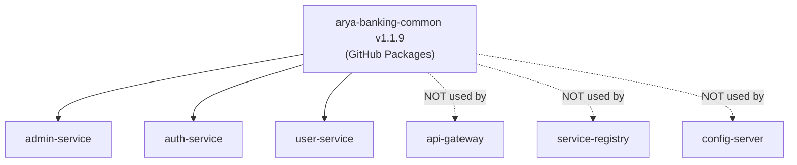
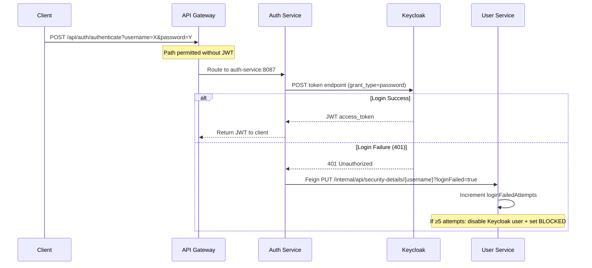
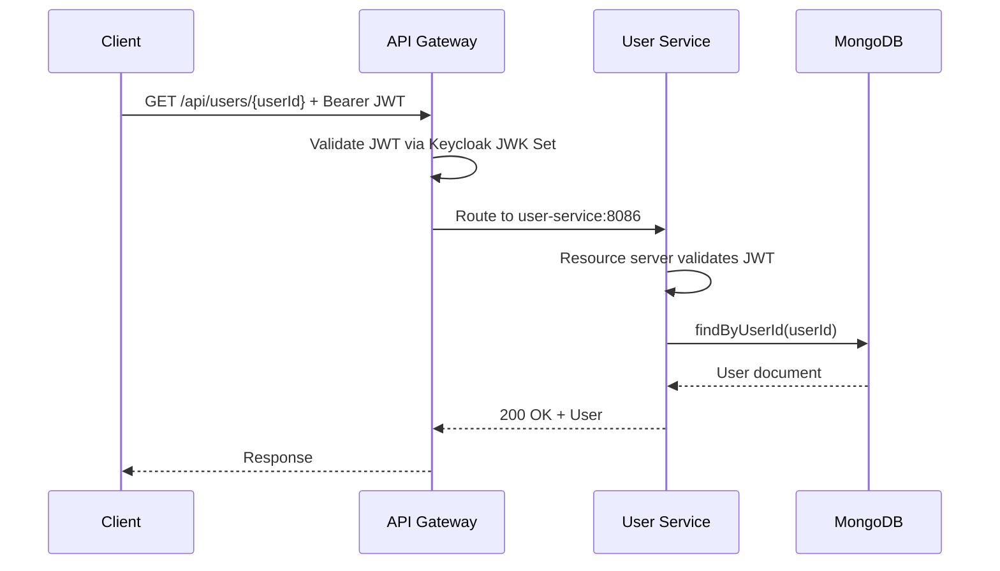
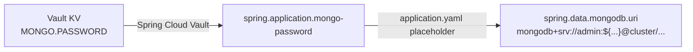
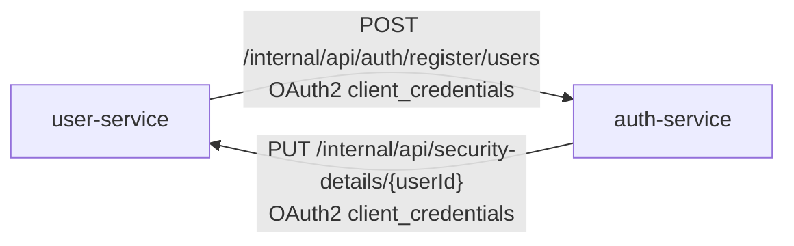
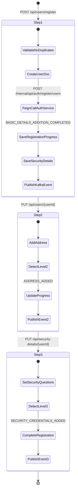
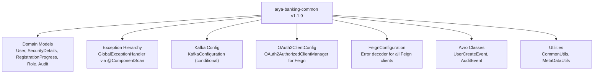
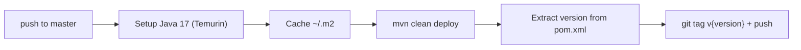

## Platform Summary

**Arya Banking** is an event-driven microservices platform modelling the core backend of a digital banking application. It is built around a service mesh of independently deployable Spring Boot services coordinated through Spring Cloud infrastructure (Eureka + Config Server), secured via Keycloak OAuth2/JWT, secrets-managed through HashiCorp Vault, and event-driven via Apache Kafka with Avro schemas.



The platform currently has **9 repositories**, each with a distinct responsibility:


| Repository | Role |
|---|---|
| `arya-banking-common` | Shared library: domain models, exceptions, Kafka config, Avro, utilities |
| `arya-banking-admin-service` | Infrastructure admin: Vault CRUD, Keycloak roles/clients, HCL policies |
| `arya-banking-auth-service` | Authentication: Keycloak user lifecycle, login, JWT issuance |
| `arya-banking-user-service` | User domain: registration, profile, security details |
| `arya-banking-api-gateway` | Single entry point: routing, JWT validation, public/private path rules |
| `arya-banking-service-registry` | Eureka server: service discovery |
| `arya-banking-config-server` | Spring Cloud Config Server: centralized properties from Git |
| `arya-banking-configs` | Git-backed config files consumed by Config Server |
| `arya-banking-infra` | Docker Compose infrastructure: Kafka, Keycloak, Vault, Platform |


---

## Explore the Service Documentation

Dive deeper into individual service documentation:


| Service | Description | Docs |
|---|---|---|
| **Admin Service** | Infrastructure administration — Vault CRUD, Keycloak roles/clients, HCL policies | [View Admin Service Docs →]() |




---

## Repository Map

```text
Event-Based-Banking-Application/
│
├── arya-banking-infra/                  ← Docker Compose infra (run first)
│   ├── compose/
│   │   ├── kafka.yml                    ← Kafka KRaft + Schema Registry + Connect
│   │   ├── keycloak.yml                 ← Keycloak 26 + PostgreSQL 15
│   │   ├── platform.yml                 ← Eureka (service-registry) + Config Server
│   │   └── vault.yml                    ← HashiCorp Vault 1.21
│   └── Makefile                         ← make up / make kafka / make keycloak etc.
│
├── arya-banking-configs/                ← Git config repo (read by config-server)
│   └── application.yml                  ← Shared: Eureka URL, Kafka, MongoDB URI, Gateway routes
│
├── arya-banking-service-registry/       ← Eureka Server (port 8761)
├── arya-banking-config-server/          ← Spring Cloud Config Server (port 8090)
│
├── arya-banking-api-gateway/            ← Spring Cloud Gateway (port 8085)
│
├── arya-banking-auth-service/           ← Auth service (port 8087)
├── arya-banking-user-service/           ← User service (port 8086)
├── arya-banking-admin-service/          ← Admin service (port 8089)
│
└── arya-banking-common/                 ← Shared library (GitHub Packages, v1.1.9)
```

---

## System Architecture





---

## Service Port Reference


| Service | Port | Protocol | Notes |
|---|---|---|---|
| `arya-banking-api-gateway` | **8085** | HTTP (Reactive/WebFlux) | Single entry point for all clients |
| `arya-banking-user-service` | **8086** | HTTP (Servlet/MVC) | |
| `arya-banking-auth-service` | **8087** | HTTP (Servlet/MVC) | |
| `arya-banking-admin-service` | **8089** | HTTP (Servlet/MVC) | |
| `arya-banking-config-server` | **8090** | HTTP | Config Server |
| `arya-banking-service-registry` | **8761** | HTTP | Eureka Dashboard |
| HashiCorp Vault | **8091** | HTTP (→ 8200 inside Docker) | TLS disabled (dev mode) |
| Kafka | **9092** | PLAINTEXT | External; 29092 internal Docker |
| Schema Registry | **8081** | HTTP | Avro schema management |
| Kafka Connect | **8082** | HTTP | Connector REST API |
| Keycloak | **5433** | HTTP (→ 8080 inside Docker) | Admin console + token endpoint |
| PostgreSQL (Keycloak DB) | **5432** | TCP | |


---

## How the Repos Fit Together

### Startup Order

```text
1. arya-banking-infra  (make up)
   ├── Kafka + Schema Registry
   ├── Keycloak + PostgreSQL
   ├── HashiCorp Vault       ← unseal manually after first boot
   └── service-registry + config-server

2. arya-banking-admin-service  (first microservice up)
   └── Used to provision Vault secrets + AppRoles + Keycloak clients

3. arya-banking-auth-service
4. arya-banking-user-service
5. arya-banking-api-gateway
```

### Config Resolution Chain





### Shared Library Chain



The common library provides:

- **Domain Models** — `User`, `SecurityDetails`, `RegistrationProgress`, `Role`, `Audit`
- **Exception Hierarchy** — `GlobalExceptionHandler` scanned via `@ComponentScan`
- **Kafka Config** — `KafkaConfiguration` bean (conditional on bootstrap servers)
- **OAuth2 Client Config** — `OAuth2AuthorizedClientManager` for Feign interceptors
- **Feign Configuration** — error decoder wired into all Feign clients
- **Avro Classes** — `UserCreateEvent`, `AuditEvent` generated from `.avsc` schemas
- **Utilities** — `CommonUtils` (isEmpty, SHA256), `MetaDataUtils` (versioning)

---

## Request Lifecycle — End to End

### Example: User Login



### Example: Get User by ID (Authenticated)



---

## Secrets & Configuration Flow

### Vault Secret Paths


| Service | Vault Path | What's Stored |
|---|---|---|
| `admin-service` | `secret/arya-banking/admin-service/dev` | `keycloak.client-secret`, etc. |
| `auth-service` | `secret/arya-banking/auth-service/dev` | `AUTH.SERVICE.CLIENT.SECRET`, `ARYA.BANKING.AUTH.CLIENT.SECRET` |
| `user-service` | `secret/arya-banking/user-service/dev` | `MONGO.PASSWORD`, `USER.SERVICE.CLIENT.SECRET` |


### AppRole Credentials

Each service has its own Vault AppRole. The `role-id` and `secret-id` are currently stored directly in `bootstrap.yml`.



### How MONGO.PASSWORD Reaches MongoDB



---

## Authentication & Authorization Model

### Keycloak Realm




| Client | Grant Type | Used By | Purpose |
|---|---|---|---|
| `banking-service-client` | `authorization_code` | API Gateway | Browser-facing login flow |
| `auth-service-client` | `client_credentials` | auth-service | Feign inter-service calls |
| `user-service-client` | `client_credentials` | user-service | Feign inter-service calls |
| `admin-service-client` | `client_credentials` | admin-service | Keycloak Admin API |
| `arya-banking-auth-client` | `password` (ROPC) | auth-service | Direct username/password login |
| `INTERNAL_SERVICE` | _(Keycloak role)_ | All services | Service-to-service auth |


### JWT Role Extraction

All services share the same converter pattern — extract `realm_access.roles` from the Keycloak JWT and prefix with `ROLE_`:

```java {linenos=table, anchorlinenos=true}
// Present in: admin-service, auth-service, user-service, api-gateway
Map<String, Object> realmAccess = jwt.getClaim("realm_access");
roles.stream().map(role -> "ROLE_" + role)
```

### Security Rules by Service


| Service | Public Paths | Internal Paths | Admin-only |
|---|---|---|---|
| `api-gateway` | `/api/users/register`, `/api/auth/authenticate` | `/internal/**` → `ROLE_INTERNAL_SERVICE` | — |
| `auth-service` | `/api/auth/authenticate` | `/internal/**` → `ROLE_INTERNAL_SERVICE` | — |
| `user-service` | `/api/**` (currently all permitted) | `/internal/**` → `ROLE_INTERNAL_SERVICE` | — |
| `admin-service` | — | `/internal/**` → `ROLE_INTERNAL_SERVICE` | All `/api/admin/**` → `ROLE_ADMIN` |




---

## Event-Driven Flow (Kafka)

### Topics


| Topic | Producer | Consumer (Planned) | Avro Schema |
|---|---|---|---|
| `user.create.event` | user-service (`UserCreateProducer`) | TBD (notification, audit) | `UserCreateEvent` |
| `audit.event` | TBD | TBD | `AuditEvent` |


### UserCreateEvent Schema

```json {linenos=table, anchorlinenos=true}
{
  "type": "record",
  "name": "UserCreateEvent",
  "fields": [
    { "name": "userId",            "type": "string" },
    { "name": "status",            "type": "string" },
    { "name": "isEmailVerified",   "type": "boolean", "default": false },
    { "name": "isContactVerified", "type": "boolean", "default": false }
  ]
}
```

### When Events Are Published


| Trigger | Status in Event |
|---|---|
| Step 1 complete (basic details) | `BASIC_DETAILS_ADDITION_COMPLETED` |
| Step 2 complete (address added) | `ADDRESS_ADDED` |
| Step 3 complete (security questions) | `SECURITY_CREDENTIALS_ADDED` |
| User blocked (5 failed logins) | `BLOCKED` |
| Any user update | Current `user.status` |


---

## Inter-Service Communication (Feign + OAuth2)

### Service-to-Service Calls



### OAuth2 Feign Interceptor Pattern

Both services use the same interceptor pattern for machine-to-machine JWT authentication:

```java {linenos=table, anchorlinenos=true}
// OAuth2FeignConfig (both auth-service and user-service)
@Bean
public RequestInterceptor oauth2RequestInterceptor() {
    return requestTemplate -> {
        OAuth2AuthorizeRequest request = OAuth2AuthorizeRequest
            .withClientRegistrationId(clientRegistrationId)
            .principal(clientRegistrationId).build();
        OAuth2AuthorizedClient client = authorizedClientManager.authorize(request);
        requestTemplate.header(AUTHORIZATION,
            "Bearer " + client.getAccessToken().getTokenValue());
    };
}
```



---

## Infrastructure Stack

All compose files share the external network `arya-banking-net`. The `Makefile` is the primary operator interface.



{}
**`compose/kafka.yml`**
- Kafka (KRaft mode, single broker+controller)
- Schema Registry (backward compatibility)
- Kafka Connect (REST API on 8082)
- Network: `arya-banking-net`
{}

{}
**`compose/keycloak.yml`**
- PostgreSQL 15 (Keycloak persistence, port 5432)
- Keycloak 26.0.2 — `start-dev` mode, Argon2id password hashing
- Port mapping: `5433 → 8080`
- Data persisted to `./keycloak-data`
{}

{}
**`compose/platform.yml`**
- `karthikulkarni/arya-banking-service-registry:latest` (port 8761)
- `karthikulkarni/arya-banking-config-server:latest` (port 8090)
- Both on `arya-banking-net`
{}

{}
**`compose/vault.yml`**
- HashiCorp Vault 1.21
- Port mapping: `8091 → 8200`
- File storage backend at `/vault/data`
- Config: `vault/config/vault.hcl` (UI enabled, TLS disabled)
{}



### Makefile Targets


| Target | Action |
|---|---|
| `make up` | Create network + start all stacks |
| `make down` | Stop all stacks |
| `make kafka` | Start Kafka stack only |
| `make keycloak` | Start Keycloak stack only |
| `make platform` | Start Eureka + Config Server only |
| `make vault` | Start Vault only |
| `make clean` | Down + remove volumes + orphans |


---

## User Registration Flow (Multi-Step)

The user-service implements a 3-step registration tracked via `RegistrationProgress` in MongoDB.



### userId Generation

```java {linenos=table, anchorlinenos=true}
"ARYA" + SHA256(firstName + lastName + System.currentTimeMillis())
    .substring(0, 6).toUpperCase()
// e.g. ARYA3F9A12
```

---

## Common Library Role

`arya-banking-common` is the **single source of truth** for everything shared across services. It is published to GitHub Packages and versioned independently.





---

## Dependency Version Matrix


| Component | Version | Notes |
|---|---|---|
| Spring Boot | `3.5.4` | All services |
| Spring Cloud | `2025.0.0` | All services |
| Java | `17` | All services |
| `arya-banking-common` | `1.1.9` (admin), `1.1.7` (auth, user) | Version drift |
| Keycloak Admin Client | `26.0.4` | admin-service, auth-service |
| Keycloak (Docker) | `26.0.2` | infra/keycloak.yml |
| HashiCorp Vault (Docker) | `1.21` | infra/vault.yml |
| MapStruct | `1.5.5.Final` | admin-service, user-service |
| Lombok | `1.18.36` | All services |
| Avro | `1.11.4` | common, admin-service, user-service |
| SpringDoc OpenAPI | `2.8.9` | admin-service, user-service |
| JaCoCo | `0.8.13` | All services |
| SpotBugs | `4.8.6.1` | Most services |
| Apache HttpClient5 | (default) | auth-service RestTemplate pool |
| PostgreSQL (Docker) | `15` | infra/keycloak.yml |
| Confluent Kafka | `latest` | infra/kafka.yml |


---

## CI/CD Pipeline Overview

All microservice repos share the same 3-workflow structure, delegating to shared workflows in `arya-banking-workflows`.

### Per-Repository Workflows

```text
.github/workflows/
├── deploy.yml               ← Push to master → build + deploy to GitHub Packages + git tag
├── sonar-report.yml         ← Push/PR → SonarCloud analysis
└── auto-create-issues.yaml  ← Manual → create GitHub Issues from issues.json
```

### Deploy Flow



### Required Secrets


| Secret | Purpose |
|---|---|
| `GH_PAT` | Read `arya-banking-common` from GitHub Packages + push tags |
| `SONAR_TOKEN` | SonarCloud authentication |
| `SONAR_PROJECT_KEY` | SonarCloud project identifier |
| `SONAR_ORG` | SonarCloud organization key |
| `ORG_ISSUE_TOKEN` | Auto-create GitHub Issues |




---

## Platform-Wide Observations & Gaps

### Security


| Gap | Location | Severity |
|---|---|---|
| `DELETE /api/admin/vault-secrets` missing `@PreAuthorize` | admin-service | High |
| All `/api/**` in user-service are `permitAll()` | user-service SecurityConfig | High |
| AppRole credentials hardcoded in `bootstrap.yml` | admin, auth, user service | Medium |
| `banking-service-client` secret hardcoded in gateway `application.yaml` | api-gateway | Medium |
| `user-service` uses `arya-banking-common:1.1.7` not `1.1.9` | user-service pom.xml | Low |


### Missing Implementations


| Feature | Status | Notes |
|---|---|---|
| Kafka consumers | Not implemented | Producers exist in user-service; no consumers defined anywhere |
| Spring Batch jobs | Declared, not used | Dependency in admin, user, auth service pom.xml |
| Unit / integration tests | Stub only | All test files are empty context-load stubs |
| Audit event publishing | Schema defined | `AuditEvent.avsc` exists but nothing publishes to `audit.event` |
| Admin user management APIs | Planned | In `issues.json`: list users, block/unblock, stats |




### Architectural Strengths

- Clean separation of concerns across all 9 repos
- Consistent patterns: same security config, same OAuth2 Feign interceptor, same Vault bootstrap in every service
- `arya-banking-common` significantly reduces code duplication
- Operation-based RBAC (admin-service) makes role changes a config-only update
- Vault HCL policies as classpath resources — policy-as-code, version-controlled
- `Makefile` for infra is clean and ergonomic
