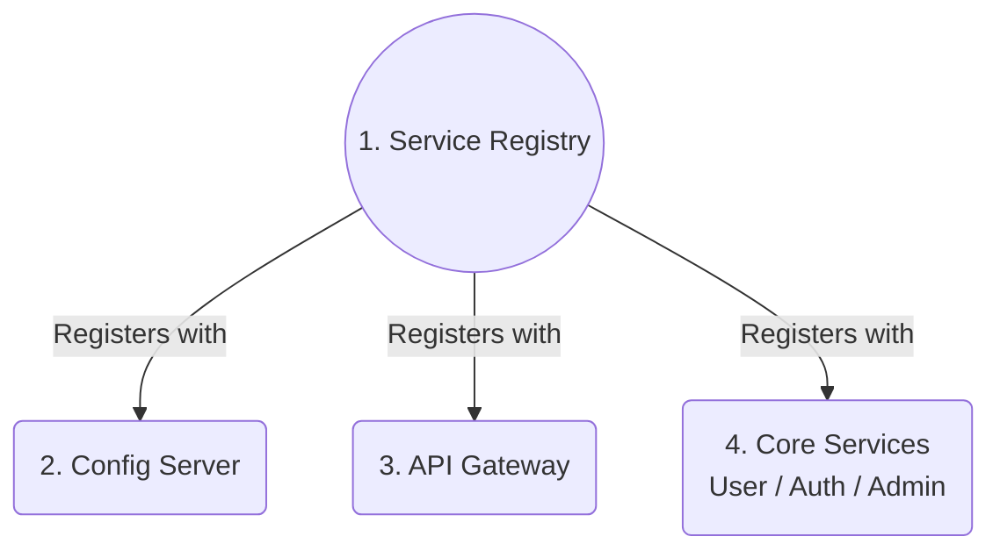
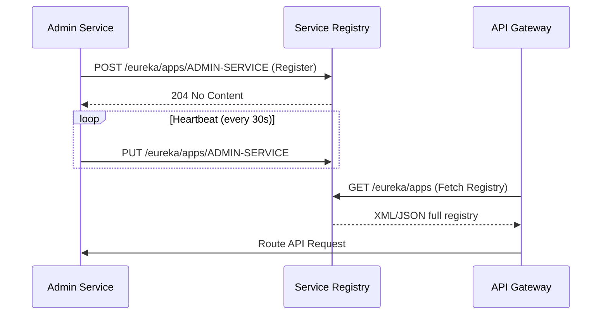

## Ecosystem Position

`arya-banking-service-registry` sits at the heart of the dynamic routing and discovery mechanism. It is the **first service in the startup sequence**. Nothing else can communicate without it.

### Startup Order Dependency



### Client Service Connections

Every client microservice in the platform points its `eureka.client.service-url.defaultZone` configuration to this server.

