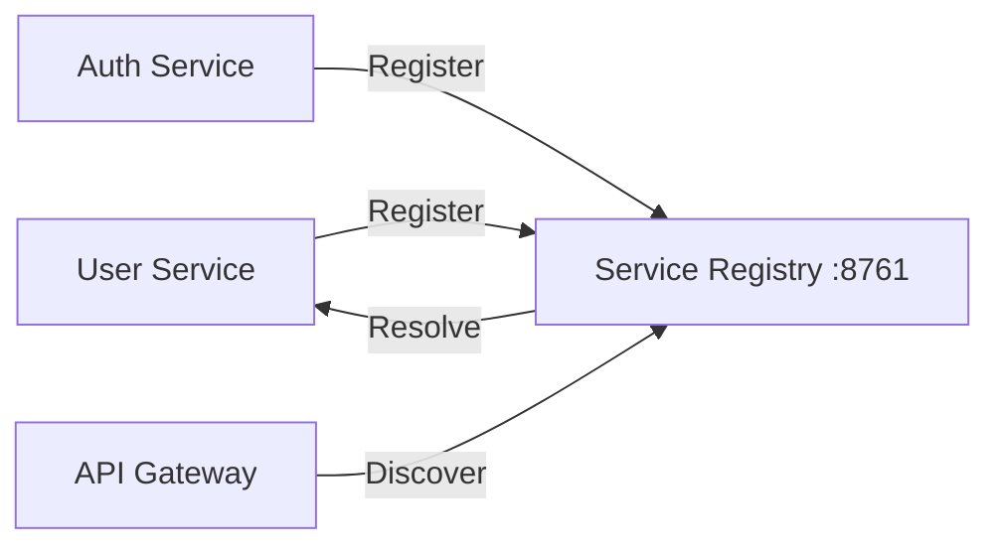

## Introduction

The `arya-banking-service-registry` is the central "phone-book" for the entire platform. Based on **Netflix Eureka**, it allows microservices to find each other dynamically without hardcoding IP addresses.

It is the **first infrastructure component** that must be started in the deployment sequence.

---

## Core Architecture

Every microservice in the Arya Banking ecosystem acts as a Eureka Client. At startup, they register their network location (IP and Port) with this server.

---

## Configuration Reference

The registry is intentionally thin, relying on default Spring Cloud Netflix Eureka settings.

### Server Settings (`application.yaml`)
* **Port**: `8761` (The standard Eureka port).
* **Self-Registration**: Disabled (`register-with-eureka: false`) to prevent the server from appearing in its own list.
* **Registry Fetching**: Disabled (`fetch-registry: false`) to conserve memory in standalone mode.

### Docker Environment
* **Internal Port**: `8761`.
* **Health Check**: Actuator is enabled at `/actuator/health`.

---

## Dashboard

When the registry is running, you can access the Eureka Dashboard to see all connected services:



---

## Known Limitations


| Limitation | Current State | Recommendation |
|---|---|---|
| **Single Point of Failure** | Running as a single instance. | Implement a peer-to-peer Eureka cluster for production. |
| **Security** | Dashboard and API are currently open. | Add `spring-security` with Basic Auth for the `/eureka/**` endpoints. |

