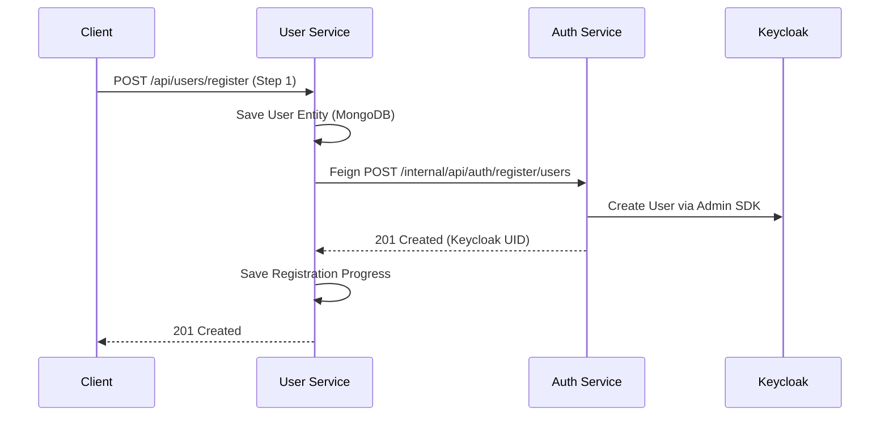
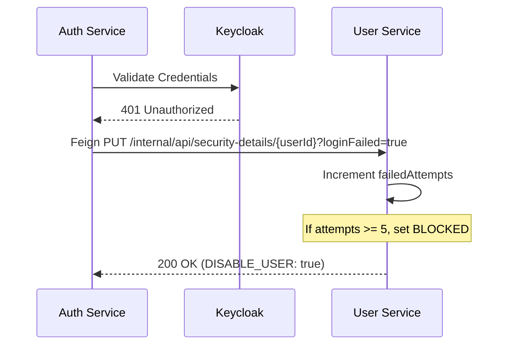

## Communication Strategies

Arya Banking utilizes three primary communication patterns to ensure scalability, security, and loose coupling.

---

## 1. Synchronous Feign (REST)

Internal service-to-service calls are handled by **OpenFeign**. To secure these calls, we use the **OAuth2 Client Credentials** grant.

### Machine-to-Machine (M2M) Flow
1. **Source Service** (e.g., Auth Service) triggers a Feign call.
2. **OAuth2 Interceptor** requests a machine-to-machine JWT from Keycloak using its own `client-id` and `client-secret`.
3. **Keycloak** returns a JWT with `ROLE_INTERNAL_SERVICE`.
4. **Source Service** injects `Authorization: Bearer <JWT>` into the outgoing request.
5. **Target Service** (e.g., User Service) validates the JWT and verifies the role.

#### Implementation Pattern
```java {linenos=table, anchorlinenos=true}
// OAuth2FeignConfig (Common Library pattern)
@Bean
public RequestInterceptor oauth2RequestInterceptor() {
    return requestTemplate -> {
        OAuth2AuthorizeRequest request = OAuth2AuthorizeRequest
            .withClientRegistrationId(clientRegistrationId).build();
        OAuth2AuthorizedClient client = authorizedClientManager.authorize(request);
        requestTemplate.header("Authorization", "Bearer " + client.getAccessToken().getTokenValue());
    };
}
```

---

## 2. API Flow Deep-Dive

### User Registration Sync
When a user registers, the flow spans two services:



### Account Locking (Login Failures)
When login fails multiple times, the **Auth Service** signals the **User Service**:



---

## 3. Asynchronous Events (Kafka)

State changes are propagated asynchronously using **Apache Kafka** and **Avro Schemas**.

### Primary Topic: `user.create.event`
Published by: `user-service`.


| Event Phase | Status Payload |
|---|---|
| **Step 1 Complete** | `BASIC_DETAILS_ADDITION_COMPLETED` |
| **Step 2 Complete** | `ADDRESS_ADDED` |
| **Step 3 Complete** | `SECURITY_CREDENTIALS_ADDED` |
| **Account Locked** | `BLOCKED` |


### Producer Logic (`UserCreateProducer`)
The `UserCreateProducer` in the User Service uses a typed `KafkaTemplate` to send Avro-encoded records. These records ensure schema compatibility across the platform.

```java
// Example usage in UserServiceImpl
userCreateProducer.sendUserCreateEvent(
    UserCreateEvent.newBuilder()
        .setUserId(user.getUserId())
        .setStatus(RegistrationConstants.BASIC_DETAILS_ADDED.getSubStatus())
        .build()
);
```

---

## 4. Port & Path Mapping Reference


| Source | Destination | Path | Purpose |
|---|---|---|---|
| User Service | Auth Service | `/internal/api/auth/register/users` | Sync registration to Keycloak |
| Auth Service | User Service | `/internal/api/security-details/{id}` | Track login failures |
| Admin Service | Keycloak | `/admin/realms/{realm}/roles` | Provision RBAC roles |
| Admin Service | Vault | `/v1/auth/approle/role` | Provision service secrets |



