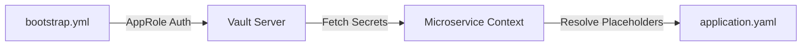

## Security Architecture

Arya Banking implements a **Zero Trust** security model for microservices, centered around centralized identity management and secure secret orchestration.

---

## 1. Identity Management (Keycloak)

**Keycloak** serves as the primary Identity Provider (IdP) and Authorization Server.

### Keycloak Realm: `event-based-banking-application`
The platform uses a dedicated realm to segregate banking users and services.

#### Core Clients

| Client ID | Grant Type | Role |
|---|---|---|
| `banking-service-client` | `authorization_code` | Browser/Mobile Login (public web client) |
| `auth-service-client` | `client_credentials` | Auth Service M2M (Feign) |
| `user-service-client` | `client_credentials` | User Service M2M (Feign) |
| `admin-service-client` | `client_credentials` | Admin Service (Keycloak Admin API) |
| `arya-banking-auth-client` | `client_credentials` | Auth Service Keycloak Admin client |




#### Inter-Service Client Provisioning
The admin-service exposes `POST /api/admin/inter-service-clients?clientName=` which creates a new confidential Keycloak client (service-accounts enabled, `client-secret` authenticator) and assigns the **`INTERNAL_SERVICE`** realm role to its service account — this is the pattern used to onboard new M2M services.

#### Realm Role
* `INTERNAL_SERVICE` — required for `/internal/**` endpoints (assigned to service accounts).

### RBAC Authorities
The standard `realm_access.roles` claim in the Keycloak JWT is extracted and converted into Spring Security authorities:
- `ADMIN` → `ROLE_ADMIN`
- `INTERNAL_SERVICE` → `ROLE_INTERNAL_SERVICE`
- `USER` → `ROLE_USER`

---

## 2. Secrets Management (HashiCorp Vault)

**HashiCorp Vault** is used to store sensitive configuration (database passwords, external API keys, etc.).

### AppRole Authentication
Instead of static tokens, microservices use **Vault AppRole** to authenticate at startup.
- **Role ID**: Unique ID for the service (configured per-service in `.gitignore`-d `vault-credentials.yml`).
- **Secret ID**: A sensitive credential used to generate a temporary Vault token (same file).

### Secret Paths
Secrets are organized by service and environment:
- `secret/data/arya-banking/user-service/dev`
- `secret/data/arya-banking/auth-service/dev`
- `secret/data/arya-banking/admin-service/dev`

### Vault Path Map (Consolidated)


| Path | Purpose |
|---|---|
| `auth/approle/role/{role}` | AppRole role definition (CRUD via admin-service) |
| `auth/approle/role/{role}/role-id` | Role ID retrieval |
| `auth/approle/role/{role}/secret-id` | Secret ID generation (create/read) |
| `secret/data/arya-banking/{service}` | KV v2 secrets per service (e.g. `user-service`, `auth-service`, `admin-service`) |
| `secret/metadata/arya-banking/{service}` | KV v2 metadata (version history, timestamps) |
| `sys/auth/*` | Auth method administration (admin-service policy) |
| `sys/policies/acl/*` | ACL policy management (admin-service policy) |


### AppRole Roles & ACL Policies

The Vault server (from `arya-banking-infra` runtime state) defines one AppRole per consuming component:


| AppRole | Associated ACL Policy | Capability |
|---|---|---|
| `_user-service` | `user-service-policy` | Read-only on `secret/data|metadata/arya-banking/user-service/*` |
| `_auth-service` | `auth-service-policy` | Read-only on `secret/data|metadata/arya-banking/auth-service/*` |
| `_admin-service` | `admin-service-policy` | Full CRUD on `secret/*`, AppRole paths, ACL policies, `sys/auth/*` |
| `_common-service` | `common-service-policy` | Read-only (common library bootstrap) |
| `_outbox-service` | `outbox-service-policy` | Read-only (outbox library bootstrap) |




### Configuration Flow


---

## 3. JWT Validation & Processing

The **API Gateway** and each **Microservice** operate as OAuth2 Resource Servers.

### Validation Strategy
1. **Signature Verification**: Services fetch the public keys (JWKs) from Keycloak's `jwk-set-uri`.
2. **Issuer Check**: Validates that the token was issued by the trusted Keycloak realm.
3. **Expiry Check**: Rejects expired tokens.

### Common JWT Converter
Every service shares a consistent logic to extract roles from the `realm_access` claim:

```java {linenos=table, anchorlinenos=true}
// Found in SecurityConfig.java across services
@Bean
public JwtAuthenticationConverter jwtAuthenticationConverter() {
    JwtAuthenticationConverter converter = new JwtAuthenticationConverter();
    converter.setJwtGrantedAuthoritiesConverter(jwt -> {
        Map<String, Object> realmAccess = jwt.getClaim("realm_access");
        Collection<String> roles = (Collection<String>) realmAccess.get("roles");
        return roles.stream()
            .map(role -> "ROLE_" + role)
            .map(SimpleGrantedAuthority::new)
            .collect(Collectors.toList());
    });
    return converter;
}
```

---

## 4. Security Observations & Hardening




| Area | Current Implementation | Recommendation |
|---|---|---|
| **Passwords** | Argon2id (Keycloak) | Keep as-is (industry standard). |
| **Secrets** | Vault AppRole | Rotate Secret IDs frequently using a sidecar or Vault Agent. |
| **Internal APIs** | `ROLE_INTERNAL_SERVICE` | Implement Mutual TLS (mTLS) for added transport-layer trust. |
| **User APIs** | `permitAll()` in User Service | Narrow scope to `ROLE_USER` or `authenticated()` after initial dev. |

