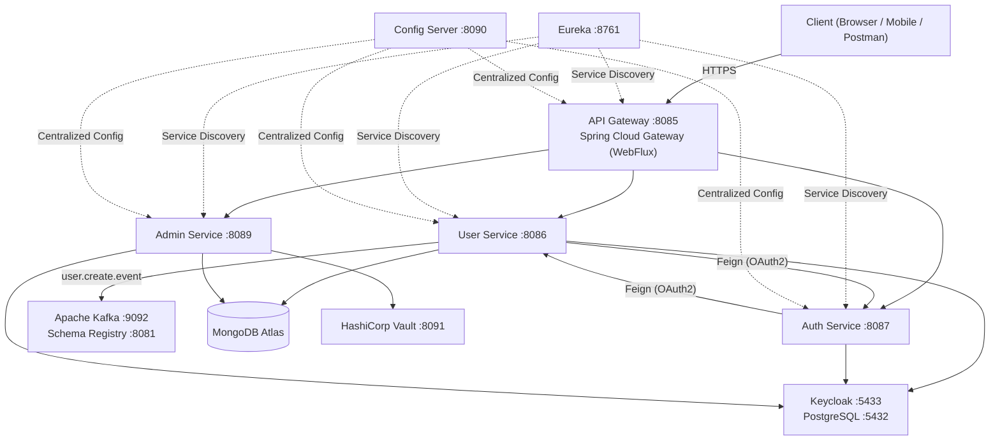

## Architectural Philosophy

Arya Banking is designed as a **distributed system** of loosely coupled microservices. It follows the **Cloud Native** pattern, leveraging specialized infrastructure for configuration, discovery, and security.

### Core Architecture Diagram

The following diagram illustrates the primary request flow and infrastructure dependencies:

---

## Component Roles


| Component | Responsibility | Technology Stack |
|---|---|---|
| **API Gateway** | Request routing, JWT validation, CORS, and rate limiting. | Spring Cloud Gateway (WebFlux) |
| **Auth Service** | Identity bridge to Keycloak, login flow, and user registration sync. | Spring Boot, Keycloak Admin SDK |
| **User Service** | Core user domain (registration progress, profiles, addresses). | Spring Boot, MongoDB, Kafka |
| **Admin Service** | Infrastructure management (Vault secrets, policy uploads, Keycloak roles). | Spring Boot, Spring Vault, Keycloak SDK |
| **Common Library** | Shared domain models, exception logic, and Kafka/Avro utilities. | Maven Library, Avro |
| **Service Registry** | Dynamic service discovery backend. | Netflix Eureka Server |
| **Config Server** | Centralized property management via Git. | Spring Cloud Config Server |


---

## Data Flow Patterns

### 1. Synchronous Request-Response
Most user-facing operations (profile lookups, login) use standard REST calls. The **API Gateway** acts as the ingress, validating the user's JWT before routing to the downstream service.

### 2. Service-to-Service (M2M)
When `auth-service` needs to talk to `user-service` (or vice-versa), it uses **Feign Clients** with a `client_credentials` OAuth2 flow. This ensures internal calls are also authenticated and authorized via Keycloak.

### 3. Asynchronous Event-Driven
State changes (like a completed registration or a blocked user) are published as **Avro-encoded events** to Apache Kafka. This allows future services (Notifications, Auditing, Analytics) to react without direct coupling.

---

## Network & Connectivity

All services run within a shared Docker network (`arya-banking-net`). External access is strictly controlled:


| Service | Internal Port | External Port | Protocol | Access |
|---|---|---|---|---|
| API Gateway | 8085 | 8085 | HTTP | Public |
| Microservices | 8086-8089 | 8086-8089 | HTTP | Restricted |
| Infrastructure | 5432, 9092, etc. | Varies | TCP/HTTP | Admin/Local |


)." />}}
