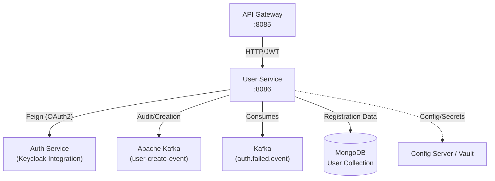
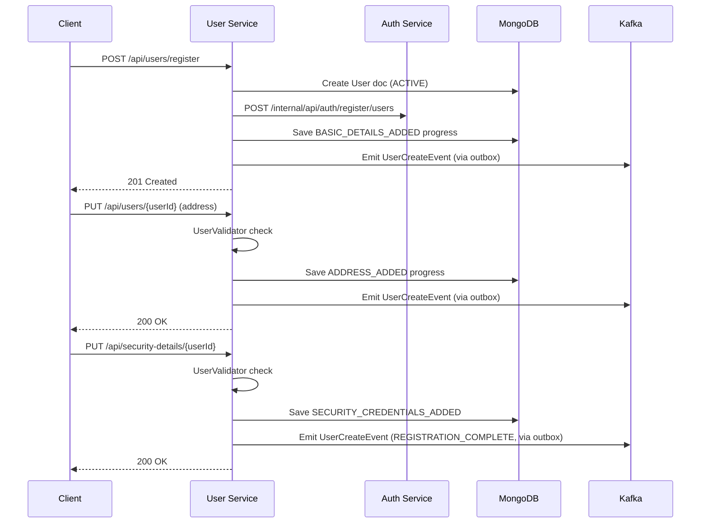

## System Architecture

The `arya-banking-user-service` sits between the API Gateway and the core infrastructure. It communicates with Keycloak for identity, Vault for secrets, and Kafka for event publishing and consumption.



---

## 3-Step Registration Flow

The registration process is a state machine controlled by the `UserValidator` and tracked in the `registration_progress` collection.



---

## Key Components

### UserValidator (Registration Engine)

The `UserValidator` is the "brain" of the registration flow. It defines the required fields for each level and advances the user's progress:
- **Level 1:** Name, email, primary contact.
- **Level 2:** At least one address.
- **Level 3:** Security questions populated on `SecurityDetails`.

### Kafka Integration

#### Producer: Transactional Outbox (`UserOutboxEventRepository`)
The service publishes events to the `user.update.event` topic via the **transactional outbox pattern** (using `arya-banking-outbox-service`). This guarantees at-least-once delivery:

1. Business operation (user create/update) + outbox record written in single MongoDB transaction
2. Outbox relay (scheduled) polls `PENDING` records and publishes to Kafka
3. Record marked `COMPLETED` on success, `FAILED` after 3 retries

```java
// In UserServiceImpl.updateUser() when locking user:
userValidator.insertToUserOutbox(userId,
    userValidator.getUserCreateEvent(userId, false, false, user.getStatus()),
    USER_UPDATED, PENDING, USER_UPDATE_TOPIC);
```

#### Consumer: `UserEventListeners`
Listens on `auth.failed.event` for `LoginFailedEvent` from Auth Service:

```java
@KafkaListener(id = "login-failed-event", topics = AUTH_FAILED_TOPIC)
public void onUserUpdateEvent(LoginFailedEvent event) {
    // Sets correlation context for tracing
    EventContext.setEventContext(
        event.getMetadata().getCorrelationId().toString(),
        event.getMetadata().getEventId().toString()
    );
    // Updates security details (increments failed attempts, locks if >= 5)
    UpdateSecurityDetailsDto dto = new UpdateSecurityDetailsDto(null, event.getIsLockUser());
    securityDetailsService.updateSecurityCredentials(
        event.getUserId().toString().toUpperCase(), dto);
}
```

---

## Security Model

- **JWT Role Extraction:** Converts Keycloak realm roles (e.g., `INTERNAL_SERVICE`) to Spring Security `ROLE_` authorities.
- **Account Locking:** If a user reaches **5 failed login attempts** (signaled via Kafka `LoginFailedEvent` from the auth service), the user is automatically set to `BLOCKED`.
- **Machine-to-Machine Auth:** Outgoing Feign calls to the auth-service are secured via `client_credentials` grant type.
