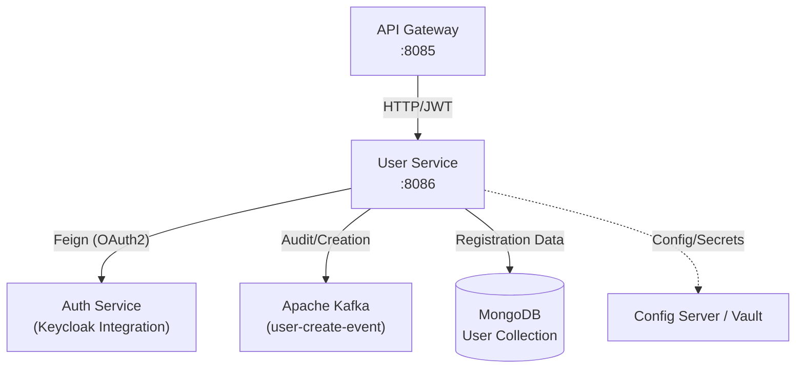
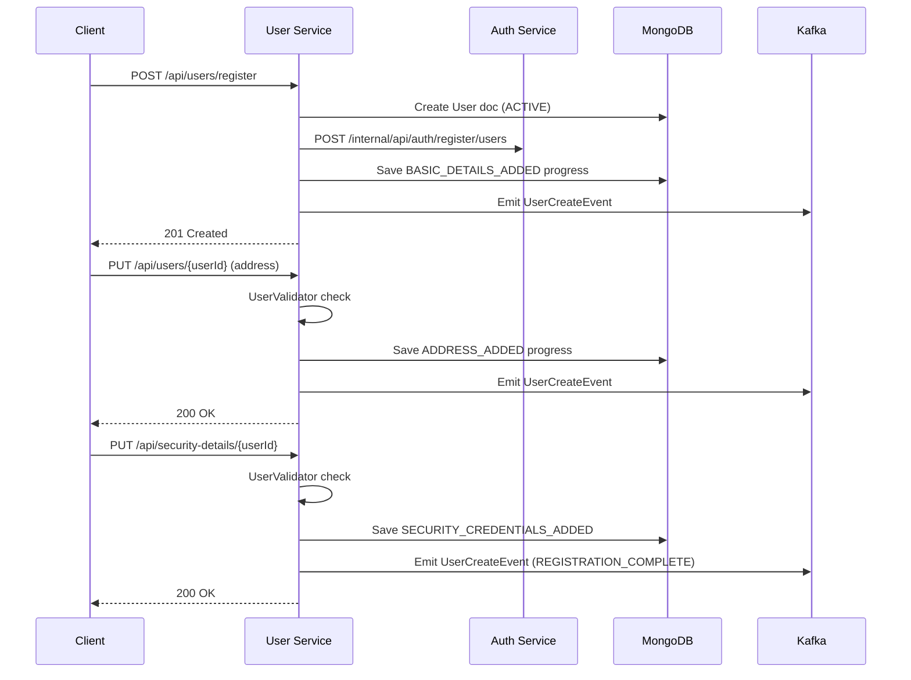

## System Architecture

The `arya-banking-user-service` sits between the API Gateway and the core infrastructure. It communicates with Keycloak for identity, Vault for secrets, and Kafka for event publishing.

---

## 3-Step Registration Flow

The registration process is a state machine controlled by the `UserValidator` and tracked in the `registration_progress` collection.

---

## Key Components

### UserValidator (Registration Engine)

The `UserValidator` is the "brain" of the registration flow. It defines the required fields for each level and advances the user's progress:
- **Level 1:** Name, email, primary contact.
- **Level 2:** At least one address.
- **Level 3:** Security questions populated on `SecurityDetails`.

### Kafka Integration (`UserCreateProducer`)

The service publishes events to the `user-create-event` topic whenever registration progress moves forward or a user's status changes.



---

## Security Model

- **JWT Role Extraction:** Converts Keycloak realm roles (e.g., `INTERNAL_SERVICE`) to Spring Security `ROLE_` authorities.
- **Account Locking:** If a user reaches **5 failed login attempts** (signaled via the `/internal` API from the auth service), the user is automatically set to `BLOCKED`.
- **Machine-to-Machine Auth:** Outgoing Feign calls to the auth-service are secured via `client_credentials` grant type.
