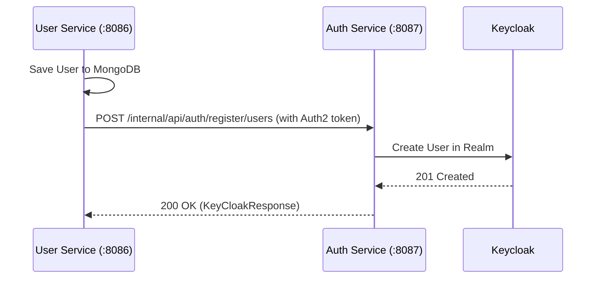

## Overview

The `arya-banking-user-service` does not communicate with Keycloak directly. Instead, it uses a **Feign Client** to call the `arya-banking-auth-service`, which handles the actual Keycloak administration tasks.

---

## User Registration Flow

When a user registers (Step 1), the following sequence occurs:

1.  **User Service**: Receives `RegisterDto`.
2.  **User Service**: Creates the `User` document in MongoDB.
3.  **User Service**: Calls `KeyCloakService.createKeyCloakUser()` via Feign.
4.  **Auth Service**: Receives the internal request, validates the internal JWT, and creates the user in Keycloak.



---

## Feign Client Configuration

The `KeyCloakService` interface is annotated with `@FeignClient`.

```java {linenos=table, anchorlinenos=true}
@FeignClient(name = "ARYA-BANKING-AUTH-SERVICE", configuration = FeignConfiguration.class)
public interface KeyCloakService {
    @PostMapping("/internal/api/auth/register/users")
    ResponseEntity<KeyCloakResponse> createKeyCloakUser(@RequestBody KeyCloakUser keyCloakUser);
}
```

### Authentication
Every outgoing call to the Auth Service is intercepted by `OAuth2FeignConfig`, which injects a `client_credentials` JWT. The Auth Service verifies this JWT and checks for the `ROLE_INTERNAL_SERVICE` authority.

---

## Keycloak User Model

The following fields are synchronized with Keycloak:
- **Username**: The generated `userId` (e.g., `ARYA3F9A12`).
- **FirstName**: User's first name.
- **LastName**: User's last name.
- **Email**: User's email ID.
- **Password**: Provided raw password (hashed by Keycloak).

{}
**Important:** If the Keycloak synchronization fails, the registration process will throw a `GlobalException`. Ensure `arya-banking-auth-service` is up and healthy.
{}
